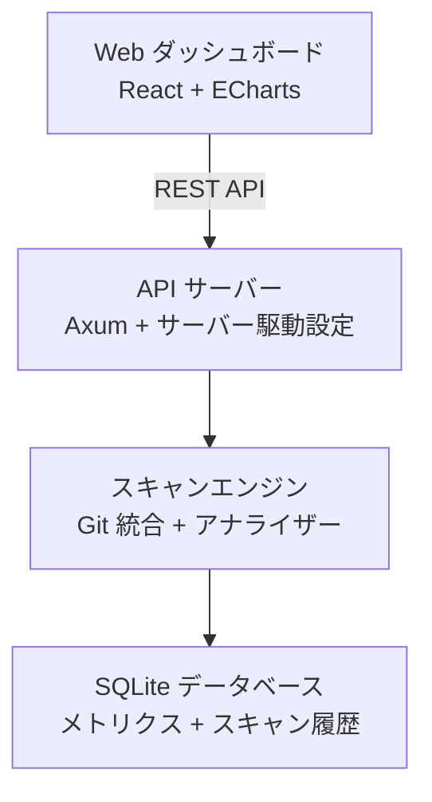

# CodePrism

<p align="center">
  <strong>🔬 Git リポジトリ向け高性能コード分析ツール</strong>
</p>

<p align="center">
  <a href="#-クイックスタート">クイックスタート</a> •
  <a href="#-インストール">インストール</a> •
  <a href="#-cli-リファレンス">CLI リファレンス</a> •
  <a href="#-設定">設定</a>
</p>

<p align="center">
  <a href="./README.md">English</a> |
  <a href="./README.zh-CN.md">简体中文</a> |
  <a href="./README.ja.md">日本語</a>
</p>

<p align="center">
  <a href="https://github.com/yougikou/code-prism/releases"></a>
  <a href="https://github.com/yougikou/code-prism/actions"></a>
  <a href="./LICENSE"></a>
</p>

---

CodePrism は Rust で構築された**高性能コード分析ツール**です。Git リポジトリをスキャンし、メトリクスを抽出し、直感的な Web ダッシュボードで実用的なインサイトを提供します。


## ✨ 機能

- 🚀 **高性能** - Rust で構築された最高速度
- 📊 **豊富な分析** - 複数の集計タイプとチャート可視化
- 🔍 **マッチレベルの詳細** - 集計メトリクスから個々の正規表現/Python/WASM マッチ位置（行番号とコードコンテキスト）までドリルダウン
- 🔄 **Git 統合** - スナップショットと差分スキャンモード、バックグラウンドジョブ追跡
- 🎨 **サーバー駆動 UI** - YAML で設定可能なダッシュボード、フレキシブルグリッドレイアウト
- 📦 **マルチプロジェクト対応** - 1つの設定で複数プロジェクトを管理、再利用可能なテンプレート
- 🔌 **拡張可能なアナライザー** - 組み込み、正規表現、Python、WASM アナライザー
- 🌐 **多言語対応 (i18n)** - 英語、中国語、日本語の UI
- 📋 **スキャンジョブ追跡** - バックグラウンド実行とリアルタイムステータス監視

### アーキテクチャ

- **バックエンド**: Rust ベースの CLI と Web サーバー、Axum フレームワークを使用
- **データベース**: 自動マイグレーション付きの組み込み SQLite
- **フロントエンド**: React + TypeScript + Vite、rust-embed を使用してバイナリに埋め込み
- **チャート**: 高性能データ可視化のための Apache ECharts
- **Git 操作**: libgit2 を介した直接 Git ODB アクセス、checkout 不要

### CLI コマンド

- `init` - データベースを初期化し、デフォルト設定を作成
- `scan <repo>` - スナップショットモードでリポジトリをスキャン
- `scan <repo> --diff <old> <new>` - 差分モードでリポジトリをスキャン
- `serve` - ダッシュボード付き Web サーバーを起動
- `init-config` - デフォルト設定ファイルを生成
- `check-config` - 設定ファイルを検証
- `test-analyzers` - `custom_analyzers/` 内の全 Python アナライザーのセルフテストを実行

### アナライザー

- **組み込み**: ファイルカウント、文字カウント
- **正規表現**: YAML で設定可能なパターンマッチング
- **Python スクリプト**: `custom_analyzers/` ディレクトリの永続プロセスアナライザー
- **WASM**: wasmtime ランタイムによる WebAssembly モジュール

#### Python スクリプトアナライザー

Python アナライザーは **永続ループモード** で動作し、stdin/stdout を介して効率的に通信します：

- **入力**: 各スクリプトは 1 行に 1 つの JSON オブジェクトを stdin で受け取ります：
  ```json
  {"file_path": "src/main.rs", "content": "fn main() { ... }"}
  ```
- **出力**: スクリプトは JSON 配列を stdout に書き込みます：
  ```json
  [{"value": 5.0, "tags": {"metric": "complexity", "category": "complexity"}}]
  ```
- **マッチ詳細（オプション）**: アナライザーはオプションの `matches` フィールドで個々のマッチ位置情報を返せます：
  ```json
  [{
    "value": 3.0,
    "tags": {"metric": "todo_count", "category": "quality"},
    "matches": [
      {"file_path": "src/main.rs", "line_number": 42, "column_start": 9, "column_end": 21, "matched_text": "TODO: refactor", "context_before": "// FIXME: optimize", "context_after": "fn main() {"}
    ]
  }]
  ```
  マッチ詳細はスキャンごとに保存され、Web ダッシュボードの子リストモーダルでファイルパスをクリックすると表示できます。
- **ライフサイクル**: スクリプトは一度起動され、複数の分析リクエスト間で再利用されます。

各 Python アナライザーには `test()` 関数を含めることができ、以下のように実行します：
```bash
python custom_analyzers/my_analyzer.py test
```

全アナライザーのセルフテストを一度に実行：
```bash
codeprism test-analyzers
```
`custom_analyzers/` 内のすべての `.py` ファイルを自動検出し、テストエントリポイントを実行します。

**アナライザー例**（`custom_analyzers/`）：
- [`gosu_complexity.py`](custom_analyzers/gosu_complexity.py) — Gosu 言語の循環的複雑度
- [`java_complexity.py`](custom_analyzers/java_complexity.py) — Java の循環的複雑度

### マッチ詳細表示

正規表現、Python、WASM アナライザーがマッチレベルのデータを生成する場合、集計されたチャート値から個々のマッチ位置にドリルダウンできます：

1. **ファイルリストモーダル**: チャートカードの **FileText** アイコンをクリックして、全ファイルとそのメトリクス値を表示
2. **マッチ詳細モーダル**: ファイルパスをクリックして、そのファイル内の全マッチ位置を表示：
   - **行番号とカラム** — 各マッチの正確な位置
   - **マッチしたテキスト** — コード書式でハイライト表示
   - **コンテキスト行** — 前後 1 行のコンテキストで可読性向上

これにより、集計メトリクスから生の分析結果までの完全なトレーサビリティを提供します。

**API エンドポイント：**

```
GET /api/v1/projects/:project_name/scans/:scan_id/matches?file_path=<パス>[&analyzer_id=<ID>&page=1&page_size=100]
```

### スキャンモード

- **スナップショットモード**: 特定のコミットでリポジトリ全体を分析
- **差分モード**: 2つのコミットまたはブランチ間の変更を分析（追加/変更/削除の追跡）

スキャンはバックグラウンドジョブとして実行され、API と Web ダッシュボードからステータスを追跡できます。

## 📥 インストール

### ビルド済みバイナリをダウンロード（推奨）

[GitHub Releases](https://github.com/yougikou/code-prism/releases) からプラットフォームに合った最新版をダウンロード：

| プラットフォーム | ダウンロード |
|------------------|------------|
| **Linux x86_64** | `codeprism-x86_64-unknown-linux-gnu.tar.gz` |
| **macOS (Apple Silicon)** | `codeprism-aarch64-apple-darwin.tar.gz` |
| **Windows x86_64** | `codeprism-x86_64-pc-windows-msvc.zip` |

```bash
# Linux / macOS
tar xzf codeprism-*.tar.gz
chmod +x codeprism
sudo mv codeprism /usr/local/bin/

# インストール確認
codeprism --version
```

### ソースからビルド

```bash
git clone https://github.com/yougikou/code-prism.git
cd code-prism
cargo build --release
# バイナリは target/release/codeprism にあります
```

### フロントエンド Web のビルド

ビルドプロセス（`crates/server/build.rs`）は、`npm` が利用可能な場合、フロントエンドアセットを自動的にビルドしようとします。

手動でフロントエンドをビルドする場合、または自動ビルドが失敗する場合：

```bash
cd web
npm install
npm run build
# アセットは web/dist に生成されます
```


## 🚀 クイックスタート

```bash
# 1. データベースを初期化
codeprism init

# 2. リポジトリをスキャン
codeprism scan /path/to/your/repo

# 3. Web ダッシュボードを起動
codeprism serve
```

ブラウザで **http://localhost:3000** を開きます。

## 📖 CLI リファレンス

### グローバルオプション

```
codeprism [オプション] <コマンド>

オプション:
  --config <パス>    設定ファイルのパス（デフォルト: codeprism.yaml）
  --help             ヘルプ情報を表示
  --version          バージョン情報を表示
```

### コマンド

#### `init` - データベースを初期化

```bash
codeprism init
```

SQLite データベース（`codeprism.db`）を作成し、必要なスキーマを適用します。

#### `scan` - リポジトリをスキャン

```bash
codeprism scan <パス> [オプション]

引数:
  <パス>  Git リポジトリのパス（デフォルト: .）

オプション:
  -p, --project <名前>     プロジェクト名（デフォルト: ディレクトリ名）
  --mode <モード>          スキャンモード: snapshot または diff（デフォルト: snapshot）
  --commit <ハッシュ>      スキャンする特定のコミット（スナップショットモード）
  --base <ハッシュ>        比較のベースコミット（差分モード、必須）
  --target <ハッシュ>      比較のターゲットコミット（差分モード、デフォルト: HEAD）
```

**例：**

```bash
# 現在のディレクトリをスナップショットスキャン
codeprism scan .

# 特定のコミットをスキャン
codeprism scan . --commit abc123

# 2つのコミット間の差分スキャン
codeprism scan . --mode diff --base abc123 --target def456

# カスタムプロジェクト名でスキャン
codeprism scan ../my-project --project "MyApp"
```

#### `serve` - Web ダッシュボードを起動

```bash
codeprism serve [オプション]

オプション:
  --port <ポート>    サーバーポート（デフォルト: 3000）
```

**例：**

```bash
# デフォルトポートで起動
codeprism serve

# カスタムポートで起動
codeprism serve --port 8080

# カスタム設定を使用
codeprism serve --config production.yaml
```

#### `init-config` - 設定ファイルを生成

```bash
codeprism init-config [パス]

引数:
  [パス]  出力ファイルパス（デフォルト: codeprism.yaml）
```

#### `check-config` - 設定ファイルを検証

```bash
codeprism check-config
```

### 終了コード

| コード | 説明 |
|--------|------|
| `0` | 成功 |
| `1` | 一般エラー |
| `2` | 設定エラー |
| `3` | データベースエラー |
| `4` | Git エラー |

## ⚙️ 設定

CodePrism は YAML 設定ファイルを使用します。詳細は[設定ガイド](#設定ファイル形式)を参照してください。

```bash
# デフォルト設定を生成
codeprism init-config

# カスタム設定を使用
codeprism --config my-config.yaml scan .
```

### 設定ファイル形式

```yaml
database_url: "sqlite:codeprism.db"

global_excludes:
  - "**/.git/**"
  - "**/node_modules/**"

tech_stacks:
  - name: "Rust"
    extensions: ["rs", "toml"]
    analyzers: ["char_count"]

aggregation_views:
  top_files:
    title: "Top 10 最大ファイル"
    tech_stacks: ["Rust"]
    func:
      type: "top_n"
      metric_key: "char_count"
      limit: 10
    chart_type: "bar_row"
```

**ビュー表示ルール：**
- `tech_stacks` が**未定義**または**空**のビュー → **Summary** タブに表示
- `tech_stacks` に `"All"` が含まれるビュー → **Summary** タブに表示
- `tech_stacks` に特定のスタック名が含まれるビュー → 対応するテックスタックタブに表示

### 集計ビュー func 設定

集計ビューの `func` オブジェクトは以下のフィールドをサポートします：

| フィールド | 型 | 必須 | 説明 |
|------------|------|------|------|
| `type` | string | **はい** | 集計タイプ：`sum`, `avg`, `top_n`, `min`, `max`, `distribution` |
| `metric_key` | string | いいえ | メトリックキーでフィルタ（例：`"char_count"`） |
| `category` | string | いいえ | カテゴリでフィルタ（例：`"logging"`） |
| `analyzer_id` | string | いいえ | アナライザー ID でフィルタ |
| `limit` | integer | `top_n` の場合 | 返す結果数 |
| `buckets` | float[] | `distribution` の場合 | 分布統計のバケット境界 |
| `width` | integer | いいえ | グリッド幅：`1`（半幅）または `2`（全幅）。デフォルトは `1`。 |

**サポートされているグループ化キー：**

`group_by` フィールドは以下のキーをサポートします：`tech_stack`, `category`, `change_type`, `metric_key`, `analyzer_id`。

**例：**

```yaml
# metric_key のみでフィルタ
func:
  type: "sum"
  metric_key: "char_count"

# category のみでフィルタ（metric_key 指定なし）
func:
  type: "sum"
  category: "logging"
group_by: ["metric_key"]

# フィルタなし（全データを集計）
func:
  type: "sum"
```

### 予約済み metric_key

以下の `metric_key` はシステムで予約されており、カスタムアナライザーでの使用は避けてください：

| metric_key | 説明 |
|------------|------|
| `file_count` | 組み込みアナライザー、スキャンファイルレコードに対応 |
| `char_count` | 組み込みアナライザー、ファイルの文字数 |

### カスタムアナライザーガイドライン

カスタムアナライザーを開発する際は、`analyzer_id` と `metric_key` の違いを理解してください：

| フィールド | 用途 | スコープ |
|------------|------|----------|
| `analyzer_id` | **どのアナライザー**がメトリクスを生成したかを識別 | アナライザーごとにグローバルで一意 |
| `metric_key` | **どの種類の測定値**かを識別 | アナライザー間で共有可能 |
| `category` | 関連メトリクスのグループ化 | フィルタリング/整理用 |

**設計パターン：**

1. **複数のアナライザー、同じ metric_key** - 異なる言語のアナライザーが同じ `metric_key` を出力可能：
   ```yaml
   # Python 複雑度アナライザー
   analyzer_id: "python_complexity"
   metric_key: "complexity"
   
   # Java 複雑度アナライザー
   analyzer_id: "java_complexity"
   metric_key: "complexity"  # 同じ metric_key で統一クエリが可能
   ```

2. **1つのアナライザー、複数の metric_keys** - 単一のアナライザーが複数のメトリクスを出力可能：
   ```yaml
   analyzer_id: "code_quality"
   # 出力:
   #   metric_key: "todo_count"
   #   metric_key: "fixme_count"
   ```

### マルチプロジェクト設定

```yaml
projects:
  - name: "frontend"
    tech_stacks:
      - name: "React"
        extensions: ["tsx", "ts"]
        analyzers: ["char_count"]
    aggregation_views: {}

  - name: "backend"
    tech_stacks:
      - name: "Rust"
        extensions: ["rs"]
        analyzers: ["char_count"]
    aggregation_views: {}
```

プロジェクトは **Web ダッシュボード UI** から追加・削除・編集が可能で、YAML ファイルを直接編集する必要はありません。

### プロジェクトテンプレート

再利用可能なプロジェクト設定は `project_templates` で定義します：

```yaml
project_templates:
  java_service:
    tech_stacks:
      - name: "Java"
        extensions: ["java", "xml"]
        analyzers: ["char_count"]
    global_excludes:
      - "**/target/**"
```

Web ダッシュボードからテンプレートを選択して新規プロジェクトを作成できます。

## 📊 集計とチャートタイプ

### 集計タイプ

| タイプ | 説明 |
|--------|------|
| `top_n` | 値による上位 N 件 |
| `sum` | 値の合計 |
| `avg` | 平均値 |
| `min` / `max` | 最小/最大値 |
| `distribution` | バケット分布 |

### チャートタイプ

| タイプ | 説明 |
|--------|------|
| `bar_row` | 横棒グラフ |
| `bar_col` | 縦棒グラフ |
| `pie` | 円グラフ |
| `table` | データテーブル |
| `gauge` | ゲージメーター |
| `radar` | レーダーチャート |
| `line` | 折れ線グラフ |
| `heatmap` | ヒートマップ |

## 🏗️ アーキテクチャ



## 📚 ドキュメント

- [API ドキュメント](http://localhost:3000/swagger-ui)（サーバー実行中）
- OpenAPI 仕様: `/api-docs/openapi.json`

## 🤝 コントリビューション

コントリビューションを歓迎します！上記のドキュメントでガイドラインをご確認ください。

## 📄 ライセンス

MIT License - 詳細は [LICENSE](./LICENSE) を参照
