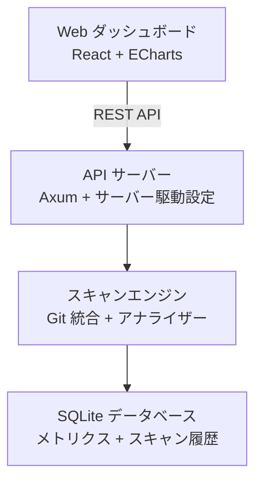

# CodePrism

<p align="center">
  <strong>🔬 Git リポジトリ向け高性能コード分析ツール</strong>
</p>

<p align="center">
  <a href="#-クイックスタート">クイックスタート</a> •
  <a href="#-インストール">インストール</a> •
  <a href="#-cli-リファレンス">CLI リファレンス</a> •
  <a href="#-設定">設定</a>
</p>

<p align="center">
  <a href="./README.md">English</a> |
  <a href="./README.zh-CN.md">简体中文</a> |
  <a href="./README.ja.md">日本語</a>
</p>

<p align="center">
  <a href="https://github.com/yougikou/code-prism/releases"></a>
  <a href="https://github.com/yougikou/code-prism/actions"></a>
  <a href="./LICENSE"></a>
</p>

---

CodePrism は Rust で構築された**高性能コード分析ツール**です。Git リポジトリをスキャンし、メトリクスを抽出し、直感的な Web ダッシュボードで実用的なインサイトを提供します。**サーバー駆動 UI** アーキテクチャを採用しており、ダッシュボードのビュー、チャート、集計ロジックは YAML 設定ファイルで定義されるため、フロントエンドコードを変更せずに分析をカスタマイズできます。


## ✨ 機能

- 🚀 **高性能** - Rust で構築された最高速度
- 📊 **豊富な分析** - 複数の集計タイプ（Sum、Avg、TopN、Min、Max、Distribution）とチャート可視化（棒、折れ線、円、レーダー、ヒートマップ、ゲージ、テーブル）
- 🔍 **マッチレベルの詳細** - 集計メトリクスから個々の正規表現/Python/WASM マッチ位置（行番号、コードコンテキスト、diff サイドフィルタリング）までドリルダウン
- 🔄 **Git 統合** - スナップショットと差分スキャンモード、バックグラウンドジョブ追跡
- 🗂️ **Git リポジトリ管理** - ダッシュボードからリモートリポジトリのクローン、プル、ブランチ切り替え、コミット閲覧
- 🎨 **サーバー駆動 UI** - YAML で設定可能なダッシュボード、フレキシブルグリッドレイアウト、ビュー幅と変更タイプ表示モード対応
- 📦 **マルチプロジェクト対応** - 1つの設定で複数プロジェクトを管理、再利用可能なテンプレート
- 🔌 **拡張可能なアナライザー** - 組み込み、正規表現、Python、WASM アナライザー、ファイルコンテキスト・変更タイプ・スキャンモードフィルタリング対応
- 🌐 **多言語対応 (i18n)** - 英語、中国語、日本語の UI、実行時切替可能
- 📋 **スキャンジョブ追跡** - バックグラウンド実行とリアルタイムステータス監視、進捗レポート
- ⚡ **実行ページ** - リポジトリ管理、ブランチ/コミット選択、スキャン実行を統合した UI、進捗フィードバック付き

### アーキテクチャ

- **バックエンド**: Rust ベースの CLI と Web サーバー、Axum フレームワークを使用
- **データベース**: 自動マイグレーション付きの組み込み SQLite
- **フロントエンド**: React + TypeScript + Vite、rust-embed を使用してバイナリに埋め込み
- **チャート**: 高性能データ可視化のための Apache ECharts
- **Git 操作**: libgit2 を介した直接 Git ODB アクセス、checkout 不要

実行時の責務は境界ごとに分割されています。`state.rs` はサーバー共有状態、`scan_routes.rs` はスキャンジョブとサマリーの HTTP 契約、`api_error.rs` は JSON API エラー、Scanner の `summary.rs` はサマリー永続化を担当します。フロントエンドでは `services/scan.ts` がスキャンジョブ通信、`hooks/useScanJob.ts` がポーリングと ETA 状態を担当し、ページコンポーネントは表示とワークフロー調整に集中します。

npm が利用できない場合やフロントエンドビルドが失敗した場合、Cargo ビルドも失敗し、古い `web/dist` が暗黙に埋め込まれることを防ぎます。フロントエンドを事前に検証済みの CI およびリリースジョブは `CODEPRISM_SKIP_WEB_BUILD=1` を明示的に設定できますが、事前構築された `web/dist` は引き続き必要です。

### CLI コマンド

- `init` - データベースを初期化し、デフォルト設定を作成
- `scan <repo>` - スナップショットモードでリポジトリをスキャン
- `scan <repo> --diff <old> <new>` - 差分モードでリポジトリをスキャン
- `serve` - ダッシュボード付き Web サーバーを起動
- `init-config` - デフォルト設定ファイルを生成
- `check-config` - 設定ファイルを検証
- `test-analyzers` - `custom_analyzers/` 内の全 Python アナライザーのセルフテストを実行

### CLI ヘルパースクリプト

`scripts/` ディレクトリには、リポジトリ管理とバッチスキャンのためのヘルパースクリプトが含まれています：

| スクリプト | 説明 |
|------------|------|
| `codeprism-repo-list` / `.ps1` | 登録済みプロジェクトとスキャン履歴を表示 |
| `codeprism-repo-clone` / `.ps1` | リモートリポジトリをクローンしてプロジェクトに登録 |
| `codeprism-scan` / `.ps1` | 1つまたは全ての登録プロジェクトをスキャン（バッチモード対応） |
| `codeprism-scan-list` / `.ps1` | 最近のスキャンとステータスを表示 |

これらのスクリプトは、稼働中の CodePrism サーバーと REST API を介して通信し、サーバー起動モードでの自動化を提供します。定期的なスキャン、CI/CD 統合、スケジュール分析ワークフローに最適で、CLI scan コマンドを直接使用する必要はありません。

### アナライザー

- **組み込み**: ファイルカウント、文字カウント
- **正規表現**: YAML で設定可能なパターンマッチング
- **Python スクリプト**: `custom_analyzers/` ディレクトリの永続プロセスアナライザー
- **WASM**: wasmtime ランタイムによる WebAssembly モジュール

#### Python スクリプトアナライザー

Python アナライザーは **永続ループモード** で動作し、stdin/stdout を介して効率的に通信します：

- **入力**: 各スクリプトは 1 行に 1 つの JSON オブジェクトを stdin で受け取ります：
  ```json
  {"file_path": "src/main.rs", "content": "fn main() { ... }"}
  ```
- **出力**: スクリプトは JSON 配列を stdout に書き込みます：
  ```json
  [{"value": 5.0, "tags": {"metric": "complexity", "category": "complexity"}}]
  ```
- **マッチ詳細（オプション）**: アナライザーはオプションの `matches` フィールドで個々のマッチ位置情報を返せます：
  ```json
  [{
    "value": 3.0,
    "tags": {"metric": "todo_count", "category": "quality"},
    "matches": [
      {"file_path": "src/main.rs", "line_number": 42, "column_start": 9, "column_end": 21, "matched_text": "TODO: refactor", "context_before": "// FIXME: optimize", "context_after": "fn main() {"}
    ]
  }]
  ```
  マッチ詳細はスキャンごとに保存され、Web ダッシュボードの子リストモーダルでファイルパスをクリックすると表示できます。
- **ライフサイクル**: スクリプトは一度起動され、複数の分析リクエスト間で再利用されます。

各 Python アナライザーには `test()` 関数を含めることができ、以下のように実行します：
```bash
python custom_analyzers/my_analyzer.py test
```

全アナライザーのセルフテストを一度に実行：
```bash
codeprism test-analyzers
```
`custom_analyzers/` 内のすべての `.py` ファイルを自動検出し、テストエントリポイントを実行します。

**アナライザー例**（`custom_analyzers/`）：
- [`gosu_complexity.py`](custom_analyzers/gosu_complexity.py) — Gosu 言語の循環的複雑度
- [`java_complexity.py`](custom_analyzers/java_complexity.py) — Java の循環的複雑度

### マッチ詳細表示

正規表現、Python、WASM アナライザーがマッチレベルのデータを生成する場合、集計されたチャート値から個々のマッチ位置にドリルダウンできます：

1. **ファイルリストモーダル**: チャートカードの **FileText** アイコンをクリックして、全ファイルとそのメトリクス値を表示
2. **マッチ詳細モーダル**: ファイルパスをクリックして、そのファイル内の全マッチ位置を表示：
   - **行番号とカラム** — 各マッチの正確な位置
   - **マッチしたテキスト** — コード書式でハイライト表示
   - **コンテキスト行** — 前後 1 行のコンテキストで可読性向上

これにより、集計メトリクスから生の分析結果までの完全なトレーサビリティを提供します。

**API エンドポイント：**

```
GET /api/v1/projects/:project_name/scans/:scan_id/matches?file_path=<パス>[&analyzer_id=<ID>&page=1&page_size=100]
```

### スキャンモード

- **スナップショットモード**: 特定のコミットでリポジトリ全体を分析
- **差分モード**: 2つのコミットまたはブランチ間の変更を分析（追加/変更/削除の追跡）

スキャンはバックグラウンドジョブとして実行され、API と Web ダッシュボードからステータスを追跡できます。

## 📥 インストール

### ビルド済みバイナリをダウンロード（推奨）

[GitHub Releases](https://github.com/yougikou/code-prism/releases) からプラットフォームに合った最新版をダウンロード：

| プラットフォーム | ダウンロード |
|------------------|------------|
| **Linux x86_64** | `codeprism-x86_64-unknown-linux-gnu.tar.gz` |
| **macOS (Apple Silicon)** | `codeprism-aarch64-apple-darwin.tar.gz` |
| **Windows x86_64** | `codeprism-x86_64-pc-windows-msvc.zip` |

Release アーカイブには `custom_analyzers/` と、同梱された Camel アナライザーのセルフテストを実行する `scripts/verify-release-payload.py` が含まれます。`camel-java-dsl` を含む組み込みプロジェクトテンプレートは、`codeprism init` または `codeprism init-config` によって `codeprism.yaml` に直接書き込まれます。

```bash
# Linux / macOS
tar xzf codeprism-*.tar.gz
chmod +x codeprism
sudo mv codeprism /usr/local/bin/

# インストール確認
codeprism --version
```

### ソースからビルド

```bash
git clone https://github.com/yougikou/code-prism.git
cd code-prism
cargo build --release
# バイナリは target/release/codeprism にあります
```

### フロントエンド Web のビルド

ビルドプロセス（`crates/server/build.rs`）は、`npm` が利用可能な場合、フロントエンドアセットを自動的にビルドしようとします。

手動でフロントエンドをビルドする場合、または自動ビルドが失敗する場合：

```bash
cd web
npm install
npm run build
# アセットは web/dist に生成されます
```


## 🚀 クイックスタート

```bash
# 1. データベースを初期化
codeprism init

# 2. リポジトリをスキャン
codeprism scan /path/to/your/repo

# 3. Web ダッシュボードを起動
codeprism serve
```

ブラウザで **http://localhost:3000** を開きます。

## 📖 CLI リファレンス

### グローバルオプション

```
codeprism [オプション] <コマンド>

オプション:
  --config <パス>    設定ファイルのパス（デフォルト: codeprism.yaml）
  --help             ヘルプ情報を表示
  --version          バージョン情報を表示
```

### コマンド

#### `init` - データベースを初期化

```bash
codeprism init
```

SQLite データベース（`codeprism.db`）を作成し、必要なスキーマを適用します。

#### `scan` - リポジトリをスキャン

```bash
codeprism scan <パス> [オプション]

引数:
  <パス>  Git リポジトリのパス（デフォルト: .）

オプション:
  -p, --project <名前>     プロジェクト名（デフォルト: ディレクトリ名）
  --mode <モード>          スキャンモード: snapshot または diff（デフォルト: snapshot）
  --commit <ハッシュ>      スキャンする特定のコミット（スナップショットモード）
  --base <ハッシュ>        比較のベースコミット（差分モード、必須）
  --target <ハッシュ>      比較のターゲットコミット（差分モード、デフォルト: HEAD）
```

**例：**

```bash
# 現在のディレクトリをスナップショットスキャン
codeprism scan .

# 特定のコミットをスキャン
codeprism scan . --commit abc123

# 2つのコミット間の差分スキャン
codeprism scan . --mode diff --base abc123 --target def456

# カスタムプロジェクト名でスキャン
codeprism scan ../my-project --project "MyApp"
```

#### `serve` - Web ダッシュボードを起動

```bash
codeprism serve [オプション]

オプション:
  --port <ポート>    サーバーポート（デフォルト: 3000）
```

**例：**

```bash
# デフォルトポートで起動
codeprism serve

# カスタムポートで起動
codeprism serve --port 8080

# カスタム設定を使用
codeprism serve --config production.yaml
```

#### `init-config` - 設定ファイルを生成

```bash
codeprism init-config [パス]

引数:
  [パス]  出力ファイルパス（デフォルト: codeprism.yaml）
```

#### `check-config` - 設定ファイルを検証

```bash
codeprism check-config
```

### 終了コード

| コード | 説明 |
|--------|------|
| `0` | 成功 |
| `1` | 一般エラー |
| `2` | 設定エラー |
| `3` | データベースエラー |
| `4` | Git エラー |

## 🖥️ Web ダッシュボード

CodePrism には、React + TypeScript + Vite で構築された本格的な Web ダッシュボードが含まれており、バイナリに埋め込まれています。

### ページ

| ページ | ルート | 説明 |
|--------|-------|------|
| **ダッシュボード** | `/` | 各テクノロジースタックタブに設定可能なチャートを備えたメイン分析ビュー |
| **実行 (Execute)** | `/execute` | リポジトリ管理とスキャン実行 UI |
| **設定 (Config)** | `/config` | ビューとプロジェクトのビジュアル設定エディター |

### ダッシュボード機能

- **テクノロジースタックタブ** — 各スタックに専用タブと集計ビュー
- **サマリータブ** — スタック未指定または "All" のビューを表示
- **トレンドチャート** — 複数スキャンにわたるメトリクス推移の時系列折れ線グラフ
- **ドリルダウン** — チャート項目 → ファイル一覧 → マッチ位置（行番号・コードコンテキスト）の階層表示
- **変更タイプフィルタリング** — A/M/D 積み上げバーまたは切替ボタン
- **スケルトンローダー** — データ取得中のスムーズなローディング表示
- **トースト通知** — バックグラウンド操作の控えめなフィードバック

### 実行ページ機能

- **リポジトリ管理** — リモート Git リポジトリのクローン、プル、ブランチ切替
- **ローカルプロジェクト登録** — ローカルディレクトリをスキャンプロジェクトとして登録
- **スキャン実行** — ブランチ/コミット選択によるスナップショットまたは差分スキャン
- **進捗トラッキング** — スキャンジョブのリアルタイムステータスと進捗バー
- **コミットブラウザ** — 差分スキャン用のコミット検索と閲覧

### 設定ページ機能

- **ビューエディター** — 全 func タイプに対応する集計ビューの追加・編集・削除
- **プロジェクトマネージャー** — UI モーダルからプロジェクトを作成・リネーム・削除
- **テンプレート管理** — 再利用可能なプロジェクトテンプレートの保存と適用
- **ライブプレビュー** — 設定変更が YAML 出力に即時反映

### レイアウト

- **サイドバー** — ダッシュボード、実行、設定ページへの永続的ナビゲーション
- **ヘッダー** — 現在のプロジェクト情報と言語切替
- **言語切替** — 実行時に英語・中国語・日本語を切替可能

## ⚙️ 設定

CodePrism は YAML 設定ファイルを使用します。詳細は[設定ガイド](#設定ファイル形式)を参照してください。

```bash
# デフォルト設定を生成
codeprism init-config

# カスタム設定を使用
codeprism --config my-config.yaml scan .
```

### 設定ファイル形式

```yaml
database_url: "sqlite:codeprism.db"

global_excludes:
  - "**/.git/**"
  - "**/node_modules/**"

tech_stacks:
  - name: "Rust"
    extensions: ["rs", "toml"]
    analyzers: ["char_count"]

aggregation_views:
  top_files:
    title: "Top 10 最大ファイル"
    tech_stacks: ["Rust"]
    func:
      type: "top_n"
      metric_key: "char_count"
      limit: 10
    chart_type: "bar_row"
```

**ビュー表示ルール：**
- `tech_stacks` が**未定義**または**空**のビュー → **Summary** タブに表示
- `tech_stacks` に `"All"` が含まれるビュー → **Summary** タブに表示
- `tech_stacks` に特定のスタック名が含まれるビュー → 対応するテックスタックタブに表示

### 集計ビュー func 設定

集計ビューの `func` オブジェクトは以下のタグベースフィルタリングフィールドをサポートします：

| フィールド | 型 | 必須 | 説明 |
|------------|------|------|------|
| `type` | string | **はい** | 集計タイプ：`sum`, `avg`, `top_n`, `min`, `max`, `distribution` |
| `tag_filters` | object | いいえ | キー・バリューフィルタ対（例：`metric: char_count`, `category: size`） |
| `analyzer_id` | string または string[] | いいえ | アナライザー ID でフィルタ |
| `limit` | integer | `top_n` の場合 | 返す結果数 |
| `order` | string | `top_n` の場合 | ソート順：`"desc"`（デフォルト）または `"asc"` |
| `buckets` | float[] | `distribution` の場合 | 分布統計のバケット境界 |

**追加ビューフィールド：**

| フィールド | 型 | デフォルト | 説明 |
|------------|------|---------|------|
| `width` | integer | `1` | グリッド幅：`1`（半幅）または `2`（全幅） |
| `include_children` | boolean | `true` | 集計結果に子エントリを含めるか |
| `change_type_mode` | string | — | 変更タイプ表示：`"all"`（積み上げ）、`"switchable"`（A/M/D 切替）、未設定（フィルタなし） |
| `group_by` | string[] | `[]` | グループ化キー：`tech_stack`, `category`, `change_type`, `metric_key`, `analyzer_id` |
| `trend` | boolean | `false` | トレンド/時系列チャートモードを有効化 |
| `trend_limit` | integer | `30` | トレンドに含める最近のスキャン数 |

**サポートされているグループ化キー：**

`group_by` フィールドは以下のキーをサポートします：`tech_stack`, `category`, `change_type`, `metric_key`, `analyzer_id`。

**例：**

```yaml
# metric_key のみでフィルタ
func:
  type: "sum"
  tag_filters:
    metric: "char_count"

# category のみでフィルタ（metric_key 指定なし）
func:
  type: "sum"
  tag_filters:
    category: "logging"
group_by: ["metric_key"]

# フィルタなし（全データを集計）
func:
  type: "sum"
```

**TopN のソート順：**

```yaml
# 最大のファイル TOP10（降順、デフォルト）
func:
  type: "top_n"
  tag_filters:
    metric: "char_count"
  limit: 10
  order: "desc"

# 最小のファイル TOP10（昇順）
func:
  type: "top_n"
  tag_filters:
    metric: "char_count"
  limit: 10
  order: "asc"
```

**ビュー幅と変更タイプモード：**

```yaml
# 全幅ビュー、A/M/D 積み上げ表示
aggregation_views:
  code_churn:
    title: "テクノロジースタック別コード変動"
    chart_type: bar_col
    width: 2
    change_type_mode: all
    func:
      type: sum
      tag_filters:
        metric: char_count

# A/M/D 切替ボタン
  changes:
    title: "カテゴリ別変更"
    change_type_mode: switchable
    func:
      type: sum
```

### トレンド / 時系列チャート

トレンドチャートを使用すると、同じリポジトリを異なるコミット時点で複数回スキャンすることで、メトリクスの経時変化を追跡できます。既存の `aggregation_view` にトレンドフィールドを追加するだけで設定できます。

**トレンド専用フィールド：**

| フィールド | 型 | デフォルト | 説明 |
|------------|------|---------|------|
| `trend` | boolean | `false` | トレンドチャートモードを有効化 |
| `trend_limit` | integer | `30` | トレンドに含める最近のスキャン数 |

**仕組み：**

1. 各スキャンは Git コミットタイムスタンプ（`commit_timestamp`）をデータベースに保存
2. ビューに `trend: true` が設定されている場合、ダッシュボードはそれを単一スキャンとは独立した多系列折れ線グラフとして表示
3. バックエンドはコミット時刻順に最近のスキャンをクエリし、各スキャンの集計データを時系列ポイントに変換
4. トレンドエンドポイントは `(label, metric_key, category, analyzer_id)` の4タプルでグループ化して系列を形成

**設定例：**

```yaml
# 単一アナライザー、単一メトリック — ファイル数の推移
aggregation_views:
  file_trend:
    title: "ファイル数の推移"
    chart_type: line
    width: 2
    trend: true
    trend_limit: 30
    func:
      type: sum
      analyzer_id: [file_count]
      tag_filters:
        category: size

# 単一アナライザーが複数の metric_key を生成（複雑度 + 行数など）
  python_trend:
    title: "Python メトリクス推移"
    group_by: [metric_key]
    chart_type: line
    width: 2
    trend: true
    trend_limit: 30
    func:
      type: sum
      analyzer_id: [my_python_analyzer]

# 複数アナライザー × 複数メトリック
  all_metrics_trend:
    title: "全メトリクス推移"
    group_by: [analyzer_id, metric_key]
    chart_type: line
    width: 2
    trend: true
    trend_limit: 50
    func:
      type: sum
      analyzer_id: [my_python_analyzer, file_count, char_count]
```

`trend: true` が設定されたビューは、通常の単一スキャンビューとしても機能します — 同じ設定で単一スキャンチャートとトレンド折れ線グラフの両方を自動的に駆動します。

**API エンドポイント：**

```
GET /api/v1/projects/:project_name/trends/:view_id?mode=snapshot&limit=20
```

クエリパラメータ：
- `mode` — `"snapshot"`（デフォルト）または `"diff"`
- `limit` — 含めるスキャン数（最大 100）
- `base_commit` — 差分モードでベースコミットによるフィルタリング

**トレンドチャートの機能：**
- X 軸: 時間（コミットタイムスタンプ）
- Y 軸: メトリック値
- スクロール可能な凡例付き多系列表示
- インタラクティブデータズーム（ホイール・スライダー）
- ホバーツールチップに日付と値を表示

**注意事項：**
- `Sum` と `Avg` 集計タイプがトレンドに最も適しています（安定した解釈可能な系列）
- `TopN` はトップ項目がスキャン間で変わる可能性があるため、不連続な系列になる場合があります
- トレンドビューはダッシュボードに **Trend** バッジ付きで表示されます
- トレンドデータは選択されたスキャンとは独立して読み込まれます

### 予約済み metric_key

以下の `metric_key` はシステムで予約されており、カスタムアナライザーでの使用は避けてください：

| metric_key | 説明 |
|------------|------|
| `file_count` | 組み込みアナライザー、スキャンファイルレコードに対応 |
| `char_count` | 組み込みアナライザー、ファイルの文字数 |

### カスタムアナライザーガイドライン

#### クロスファイル・カスタムアナライザー

クロスファイルスクリプトは `extract` / `finalize` の2段階プロトコルを使用します。`extract` はアナライザー自身が決めた `group_key` を返し、`finalize` は `{"findings": [...]}` を返します。各 finding は `finding_key`、`content`、`occurrences`、`tags`、`metrics` を明示します。finding の採否、最小ファイル数、最小行数、グルーピング方法、メトリクス計算はスクリプト内部の責務であり、YAML には置きません。YAML は `tags`、`scan_mode`、`change_type` などフレームワーク用メタデータだけを保持します。

フレームワークは検証とトランザクション保存を担当します。1つのアナライザーが失敗しても一度再試行し、中間データを保持したまま他のアナライザーを続行します。ジョブ状態は `completed_with_errors` です。成功時の中間データは同じトランザクションで削除され、失敗データは起動時に7日を超えたものだけ削除されます。Diff は変更ファイルのみを解析します。

カスタムアナライザーを開発する際は、`analyzer_id` と `metric_key` の違いを理解してください：

| フィールド | 用途 | スコープ |
|------------|------|----------|
| `analyzer_id` | **どのアナライザー**がメトリクスを生成したかを識別 | アナライザーごとにグローバルで一意 |
| `metric_key` | **どの種類の測定値**かを識別 | アナライザー間で共有可能 |
| `category` | 関連メトリクスのグループ化 | フィルタリング/整理用 |

**カスタム正規表現アナライザーのフィールド：**

| フィールド | 型 | デフォルト | 説明 |
|------------|------|---------|------|
| `pattern` | string | **必須** | マッチする正規表現パターン |
| `metric_key` | string | `"custom_match"` | 結果のメトリックキー |
| `category` | string | — | フィルタリング用のカテゴリ |
| `description` | string | — | 人間可読な説明 |
| `tags` | object | `{}` | 結果に付与する任意のキー・バリュータグ |
| `scan_mode` | string | `"all"` | 適用モード：`"all"`, `"snapshot"`, `"diff"` |
| `change_type` | string | `"all"` | 変更タイプフィルタ：`"all"`, `"A"`（追加）, `"M"`（変更）, `"D"`（削除） |

**カスタム実装/スクリプトアナライザーのフィールド：**

| フィールド | 型 | デフォルト | 説明 |
|------------|------|---------|------|
| `metric_key` | string | — | 結果のメトリックキー |
| `category` | string | — | フィルタリング用のカテゴリ |
| `description` | string | — | 人間可読な説明 |
| `tags` | object | `{}` | スクリプト出力に上書き/追加するタグ |
| `scan_mode` | string | `"all"` | 適用モード：`"all"`, `"snapshot"`, `"diff"` |
| `change_type` | string | `"all"` | 変更タイプフィルタ：`"all"`, `"A"`, `"M"`, `"D"` |

**設計パターン：**

1. **複数のアナライザー、同じ metric_key** - 異なる言語のアナライザーが同じ `metric_key` を出力可能：
   ```yaml
   # Python 複雑度アナライザー
   analyzer_id: "python_complexity"
   metric_key: "complexity"
   
   # Java 複雑度アナライザー
   analyzer_id: "java_complexity"
   metric_key: "complexity"  # 同じ metric_key で統一クエリが可能
   ```

2. **1つのアナライザー、複数の metric_keys** - 単一のアナライザーが複数のメトリクスを出力可能：
   ```yaml
   analyzer_id: "code_quality"
   # 出力:
   #   metric_key: "todo_count"
   #   metric_key: "fixme_count"
   ```

### マルチプロジェクト設定

```yaml
projects:
  - name: "frontend"
    tech_stacks:
      - name: "React"
        extensions: ["tsx", "ts"]
        analyzers: ["char_count"]
    aggregation_views: {}

  - name: "backend"
    tech_stacks:
      - name: "Rust"
        extensions: ["rs"]
        analyzers: ["char_count"]
    aggregation_views: {}
```

プロジェクトは **Web ダッシュボード UI** から追加・削除・編集が可能で、YAML ファイルを直接編集する必要はありません。

### プロジェクトテンプレート

再利用可能なプロジェクト設定は `project_templates` で定義します：

```yaml
project_templates:
  java_service:
    tech_stacks:
      - name: "Java"
        extensions: ["java", "xml"]
        analyzers: ["char_count"]
    global_excludes:
      - "**/target/**"
```

Web ダッシュボードからテンプレートを選択して新規プロジェクトを作成できます。

## 📊 集計とチャートタイプ

### 集計タイプ

| タイプ | 説明 |
|--------|------|
| `top_n` | 値による上位 N 件 |
| `sum` | 値の合計 |
| `avg` | 平均値 |
| `min` / `max` | 最小/最大値 |
| `distribution` | バケット分布 |

### チャートタイプ

| タイプ | 説明 |
|--------|------|
| `bar_row` | 横棒グラフ |
| `bar_col` | 縦棒グラフ |
| `pie` | 円グラフ |
| `table` | データテーブル |
| `gauge` | ゲージメーター |
| `radar` | レーダーチャート |
| `line` | 折れ線グラフ |
| `heatmap` | ヒートマップ |

## 🏗️ アーキテクチャ


```mermaid
flowchart TD
    A[Web ダッシュボード<br/>React + ECharts] -->|REST API| B[API サーバー<br/>Axum + サーバー駆動設定]
    B --> C[スキャンエンジン<br/>Git 統合 + アナライザー]
    C --> D[SQLite データベース<br/>メトリクス + スキャン履歴]
```

性能上の境界を明確にしています。ページと ECharts ランタイムはオンデマンドで読み込み、ダッシュボードの読み取りは短時間のリクエスト重複排除とキャンセルに対応し、非表示タブではスキャンのポーリングを停止し、スキャナーの行グループはトランザクション単位でコミットします。測定値と再現手順は[パフォーマンスベースライン](docs/performance-baseline.md)を参照してください。

## 📚 API リファレンス

### コアエンドポイント

| メソッド | パス | 説明 |
|----------|------|------|
| GET | `/api/v1/projects/:name/scans/:scan_id/views/:view_id` | 集計ビューデータを取得 |
| GET | `/api/v1/projects/:name/scans` | プロジェクトのスキャン一覧 |
| GET | `/api/v1/projects/:name/trends/:view_id` | トレンド/時系列データを取得 |
| GET | `/api/v1/projects/:name/scans/:scan_id/matches` | マッチレベル詳細を取得（ページネーション） |
| GET | `/api/v1/scans/jobs/:job_id` | スキャンジョブのステータスと進捗を取得 |
| GET | `/api/v1/config` | 現在の設定を取得 |

### プロジェクト管理

| メソッド | パス | 説明 |
|----------|------|------|
| GET | `/api/v1/projects/unified` | 全プロジェクトを一覧（設定 + DB） |
| POST | `/api/v1/projects/add-local` | ローカル Git リポジトリを登録 |
| POST | `/api/v1/projects` | 新規プロジェクトを作成 |
| DELETE | `/api/v1/projects/:name` | プロジェクトを削除 |
| POST | `/api/v1/scans/execute` | 新規スキャンを実行 |

### Git リポジトリ管理

| メソッド | パス | 説明 |
|----------|------|------|
| GET | `/api/v1/git/repos` | キャッシュされた全リポジトリを一覧 |
| POST | `/api/v1/git/clone` | リモートリポジトリをクローン |
| GET | `/api/v1/git/:repo_id/branches` | ブランチ一覧 |
| POST | `/api/v1/git/:repo_id/checkout` | ブランチ切替 |
| POST | `/api/v1/git/:repo_id/pull` | 最新変更をプル |
| GET | `/api/v1/git/:repo_id/commits` | コミット一覧（検索対応） |
| DELETE | `/api/v1/git/:repo_id` | キャッシュされたリポジトリを削除 |

### テンプレート

| メソッド | パス | 説明 |
|----------|------|------|
| GET | `/api/v1/templates` | プロジェクトテンプレート一覧 |

- ドキュメント：Swagger UI `/swagger-ui`（サーバー実行中）、OpenAPI 仕様 `/api-docs/openapi.json`

## 🤝 コントリビューション

コントリビューションを歓迎します！上記のドキュメントでガイドラインをご確認ください。

## 📄 ライセンス

MIT License - 詳細は [LICENSE](./LICENSE) を参照
