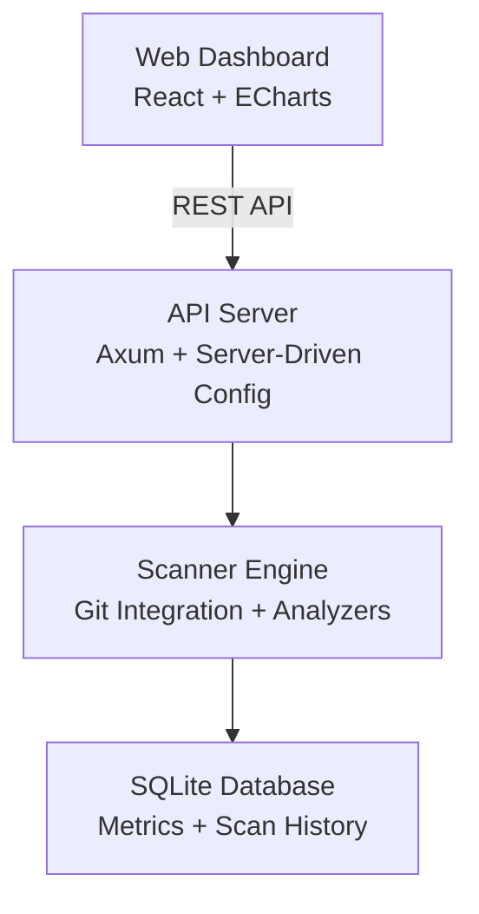

# CodePrism

<p align="center">
  <strong>🔬 High-Performance Code Analysis Tool for Git Repositories</strong>
</p>

<p align="center">
  <a href="#-quick-start">Quick Start</a> •
  <a href="#-installation">Installation</a> •
  <a href="#-cli-reference">CLI Reference</a> •
  <a href="#-configuration">Configuration</a>
</p>

<p align="center">
  <a href="./README.md">English</a> |
  <a href="./README.zh-CN.md">简体中文</a> |
  <a href="./README.ja.md">日本語</a>
</p>

<p align="center">
  <a href="https://github.com/yougikou/code-prism/releases"></a>
  <a href="https://github.com/yougikou/code-prism/actions"></a>
  <a href="./LICENSE"></a>
</p>

---

CodePrism is a **high-performance code analysis tool** built with Rust. It scans Git repositories, extracts metrics, and provides actionable insights through an intuitive web dashboard.


## ✨ Features

- 🚀 **High Performance** - Built with Rust for maximum speed
- 📊 **Rich Analytics** - Multiple aggregation types and chart visualizations
- 🔍 **Match-Level Detail** - Drill down from aggregated metrics to individual regex/Script/WASM match locations with line numbers and code context
- 🔄 **Git Integration** - Snapshot and Diff scanning modes with background job tracking
- 🎨 **Server-Driven UI** - Configurable dashboard via YAML with flexible grid layout
- 📦 **Multi-Project Support** - Manage multiple projects in one config with reusable templates
- 🔌 **Extensible Analyzers** - Built-in, regex, Python, and WASM analyzers
- 🌐 **i18n Support** - Built-in multi-language UI (English, Chinese, Japanese)
- 📋 **Scan Job Tracking** - Background scan execution with real-time status monitoring

### Architecture

- **Backend**: Rust-based CLI and web server using Axum framework
- **Database**: Embedded SQLite with automatic migrations
- **Frontend**: React + TypeScript + Vite, embedded in binary using rust-embed
- **Charts**: Apache ECharts for high-performance data visualization
- **Git Operations**: Direct Git ODB access via libgit2, no checkout required

### CLI Commands

- `init` - Initialize database and create default config
- `scan <repo>` - Scan repository in snapshot mode
- `scan <repo> --diff <old> <new>` - Scan repository in diff mode
- `serve` - Start web server with dashboard
- `init-config` - Generate default configuration file
- `check-config` - Validate configuration file
- `test-analyzers` - Run self-tests for all Python analyzers in `custom_analyzers/`

### Analyzers

- **Built-in**: File count, character count
- **Regex**: Configurable pattern matching via YAML
- **Python Script**: Persistent process analyzers in `custom_analyzers/` directory
- **WASM**: WebAssembly modules for advanced analysis via wasmtime runtime

#### Python Script Analyzers

Python analyzers operate in a **persistent loop mode** over stdin/stdout for efficiency:

- **Input**: Each script receives one JSON object per line via stdin:
  ```json
  {"file_path": "src/main.rs", "content": "fn main() { ... }"}
  ```
- **Output**: Scripts write a JSON array of results via stdout:
  ```json
  [{"value": 5.0, "tags": {"metric": "complexity", "category": "complexity"}}]
  ```
- **Match Details (Optional)**: Analyzers can return individual match locations via an optional `matches` field:
  ```json
  [{
    "value": 3.0,
    "tags": {"metric": "todo_count", "category": "quality"},
    "matches": [
      {"file_path": "src/main.rs", "line_number": 42, "column_start": 9, "column_end": 21, "matched_text": "TODO: refactor", "context_before": "// FIXME: optimize", "context_after": "fn main() {"}
    ]
  }]
  ```
  Match details are stored per-scan and viewable through the web dashboard by clicking a file path in the children viewer modal.
- **Lifecycle**: Scripts are spawned once and kept alive across analysis requests, avoiding interpreter startup overhead.

Each Python analyzer can include a `test()` function invoked via:
```bash
python custom_analyzers/my_analyzer.py test
```

Run self-tests for all analyzers at once:
```bash
codeprism test-analyzers
```
This auto-discovers all `.py` files in `custom_analyzers/` and runs their test entry point.

**Example analyzers** (`custom_analyzers/`):
- [`gosu_complexity.py`](custom_analyzers/gosu_complexity.py) — Cyclomatic complexity for Gosu language
- [`java_complexity.py`](custom_analyzers/java_complexity.py) — Cyclomatic complexity for Java

### Match Detail Viewing

When a regex, Python, or WASM analyzer produces match-level data, you can drill down from aggregated chart values to individual match locations:

1. **File List Modal**: Click the **FileText** icon on any chart card to see all files and their metric values
2. **Match Detail Modal**: Click a file path to view every match location within that file, including:
   - **Line number and column** — exact position of each match
   - **Matched text** — highlighted in the UI with code formatting
   - **Context lines** — one line of context before and after for readability

This provides full traceability from aggregated metrics down to the raw analysis results.

**API Endpoint:**

```
GET /api/v1/projects/:project_name/scans/:scan_id/matches?file_path=<path>[&analyzer_id=<id>&page=1&page_size=100]
```

### Scanning Modes

- **Snapshot Mode**: Analyze entire repository at a specific commit
- **Diff Mode**: Analyze changes between two commits or branches (tracks A/M/D change types)

Scans run as background jobs with trackable status via the API and web dashboard.

## 📥 Installation

### Download Pre-built Binary (Recommended)

Download the latest release for your platform from [GitHub Releases](https://github.com/yougikou/code-prism/releases):

| Platform | Download |
|----------|----------|
| **Linux x86_64** | `codeprism-x86_64-unknown-linux-gnu.tar.gz` |
| **macOS (Apple Silicon)** | `codeprism-aarch64-apple-darwin.tar.gz` |
| **Windows x86_64** | `codeprism-x86_64-pc-windows-msvc.zip` |

```bash
# Linux / macOS
tar xzf codeprism-*.tar.gz
chmod +x codeprism
sudo mv codeprism /usr/local/bin/

# Verify installation
codeprism --version
```

### Build from Source

```bash
git clone https://github.com/yougikou/code-prism.git
cd code-prism
cargo build --release
# Binary will be at target/release/codeprism
```

### Build Frontend Web

The build process (specifically `crates/server/build.rs`) will automatically attempt to build the frontend assets using `npm` if available.

If you want to manually build the frontend or if the automatic build fails:

```bash
cd web
npm install
npm run build
# Assets will be generated in web/dist
```


## 🚀 Quick Start

```bash
# 1. Initialize database
codeprism init

# 2. Scan your repository
codeprism scan /path/to/your/repo

# 3. Start web dashboard
codeprism serve
```

Open **http://localhost:3000** in your browser.

## 📖 CLI Reference

### Global Options

```
codeprism [OPTIONS] <COMMAND>

Options:
  --config <PATH>    Path to configuration file (default: codeprism.yaml)
  --help             Print help information
  --version          Print version information
```

### Commands

#### `init` - Initialize Database

```bash
codeprism init
```

Creates the SQLite database (`codeprism.db`) with the required schema.

#### `scan` - Scan Repository

```bash
codeprism scan <PATH> [OPTIONS]

Arguments:
  <PATH>  Path to the Git repository (default: .)

Options:
  -p, --project <NAME>     Project name (default: directory name)
  --mode <MODE>            Scan mode: snapshot or diff (default: snapshot)
  --commit <HASH>          Specific commit to scan (snapshot mode)
  --base <HASH>            Base commit for comparison (diff mode, required)
  --target <HASH>          Target commit for comparison (diff mode, default: HEAD)
```

**Examples:**

```bash
# Snapshot scan of current directory
codeprism scan .

# Scan specific commit
codeprism scan . --commit abc123

# Diff scan between two commits
codeprism scan . --mode diff --base abc123 --target def456

# Scan with custom project name
codeprism scan ../my-project --project "MyApp"
```

#### `serve` - Start Web Dashboard

```bash
codeprism serve [OPTIONS]

Options:
  --port <PORT>    Server port (default: 3000)
```

**Examples:**

```bash
# Start on default port
codeprism serve

# Start on custom port
codeprism serve --port 8080

# Use custom config
codeprism serve --config production.yaml
```

#### `init-config` - Generate Configuration

```bash
codeprism init-config [PATH]

Arguments:
  [PATH]  Output file path (default: codeprism.yaml)
```

#### `check-config` - Validate Configuration

```bash
codeprism check-config
```

### Exit Codes

| Code | Description |
|------|-------------|
| `0` | Success |
| `1` | General error |
| `2` | Configuration error |
| `3` | Database error |
| `4` | Git error |

## ⚙️ Configuration

CodePrism uses YAML configuration files. See [Configuration Guide](#configuration-file-format) for details.

```bash
# Generate default config
codeprism init-config

# Use custom config
codeprism --config my-config.yaml scan .
```

### Configuration File Format

```yaml
database_url: "sqlite:codeprism.db"

global_excludes:
  - "**/.git/**"
  - "**/node_modules/**"

tech_stacks:
  - name: "Rust"
    extensions: ["rs", "toml"]
    analyzers: ["char_count"]

aggregation_views:
  top_files:
    title: "Top 10 Largest Files"
    tech_stacks: ["Rust"]
    func:
      type: "top_n"
      metric_key: "char_count"
      limit: 10
    chart_type: "bar_row"
```

**View Display Rules:**
- Views where `tech_stacks` is **not defined** or **empty** → displayed on the **Summary** tab
- Views where `tech_stacks` contains `"All"` → displayed on the **Summary** tab
- Views where `tech_stacks` contains specific stack names → displayed on corresponding tech stack tabs

### Aggregation View func Configuration

The `func` object in aggregation views supports the following fields:

| Field | Type | Required | Description |
|-------|------|----------|-------------|
| `type` | string | **Yes** | Aggregation type: `sum`, `avg`, `top_n`, `min`, `max`, `distribution` |
| `metric_key` | string | No | Filter by metric key (e.g., `"char_count"`) |
| `category` | string | No | Filter by category (e.g., `"logging"`) |
| `analyzer_id` | string | No | Filter by analyzer ID |
| `limit` | integer | For `top_n` | Number of results to return |
| `buckets` | float[] | For `distribution` | Bucket boundaries for distribution |
| `width` | integer | No | Grid width: `1` (half) or `2` (full). Defaults to `1`. |

**Supported Grouping Keys:**

The `group_by` field supports the following keys: `tech_stack`, `category`, `change_type`, `metric_key`, `analyzer_id`.

**Examples:**

```yaml
# Filter by metric_key only
func:
  type: "sum"
  metric_key: "char_count"

# Filter by category only (no metric_key)
func:
  type: "sum"
  category: "logging"
group_by: ["metric_key"]

# No filters (aggregate all data)
func:
  type: "sum"
```

### Reserved metric_key

The following `metric_key` values are reserved for internal use. Custom analyzers should avoid using these:

| metric_key | Description |
|------------|-------------|
| `file_count` | Built-in analyzer, corresponds to scanned file records |
| `char_count` | Built-in analyzer, character count per file |

### Custom Analyzer Guidelines

When developing custom analyzers, understand the distinction between `analyzer_id` and `metric_key`:

| Field | Purpose | Scope |
|-------|---------|-------|
| `analyzer_id` | Identifies **which analyzer** produced the metric | Globally unique per analyzer |
| `metric_key` | Identifies **what type of measurement** | Can be shared across analyzers |
| `category` | Groups related metrics | For filtering/organization |

**Design Patterns:**

1. **Multiple analyzers, same metric_key** - Different language analyzers can output the same `metric_key`:
   ```yaml
   # Python complexity analyzer
   analyzer_id: "python_complexity"
   metric_key: "complexity"
   
   # Java complexity analyzer  
   analyzer_id: "java_complexity"
   metric_key: "complexity"  # Same metric_key, enables unified queries
   ```

2. **One analyzer, multiple metric_keys** - A single analyzer can output multiple metrics:
   ```yaml
   analyzer_id: "code_quality"
   # Outputs:
   #   metric_key: "todo_count"
   #   metric_key: "fixme_count"
   ```

### Multi-Project Configuration

```yaml
projects:
  - name: "frontend"
    tech_stacks:
      - name: "React"
        extensions: ["tsx", "ts"]
        analyzers: ["char_count"]
    aggregation_views: {}

  - name: "backend"
    tech_stacks:
      - name: "Rust"
        extensions: ["rs"]
        analyzers: ["char_count"]
    aggregation_views: {}
```

Projects can be managed via the **web dashboard UI** — add, rename, and remove projects without editing YAML files directly.

### Project Templates

Reusable project configurations are defined under `project_templates`:

```yaml
project_templates:
  java_service:
    tech_stacks:
      - name: "Java"
        extensions: ["java", "xml"]
        analyzers: ["char_count"]
    global_excludes:
      - "**/target/**"
```

New projects can be created from templates via the web dashboard.

## 📊 Aggregation & Chart Types

### Aggregation Types

| Type | Description |
|------|-------------|
| `top_n` | Top N items by value |
| `sum` | Sum of values |
| `avg` | Average value |
| `min` / `max` | Min/Max value |
| `distribution` | Bucket distribution |

### Chart Types

| Type | Description |
|------|-------------|
| `bar_row` | Horizontal bar |
| `bar_col` | Vertical bar |
| `pie` | Pie chart |
| `table` | Data table |
| `gauge` | Gauge meter |
| `radar` | Radar chart |
| `line` | Line chart |
| `heatmap` | Heatmap |

## 🏗️ Architecture



## 📚 Documentation

- [API Documentation](http://localhost:3000/swagger-ui) (when server running)
- OpenAPI spec at `/api-docs/openapi.json`

## 🤝 Contributing

Contributions welcome! See documentation above for guidelines.

## 📄 License

MIT License - see [LICENSE](./LICENSE)
