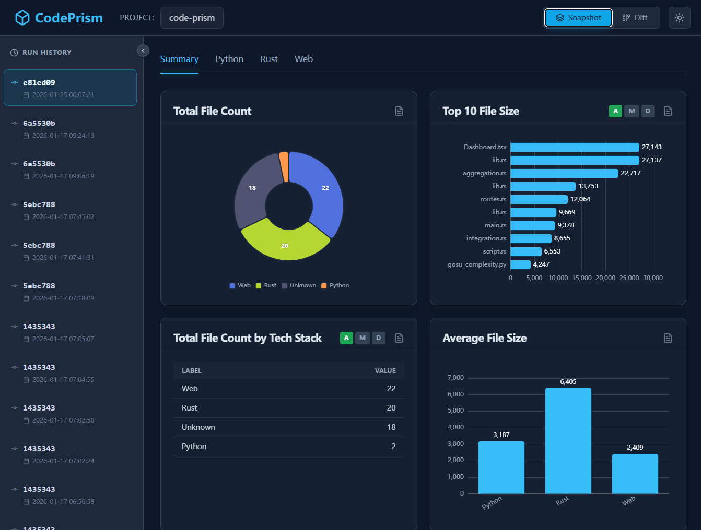
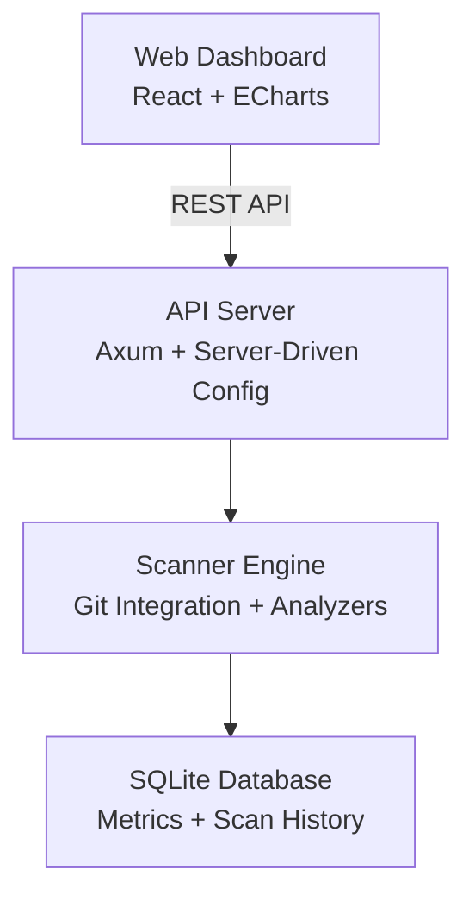

# CodePrism

<p align="center">
  <strong>🔬 High-Performance Code Analysis Tool for Git Repositories</strong>
</p>

<p align="center">
  <a href="#-quick-start">Quick Start</a> •
  <a href="#-installation">Installation</a> •
  <a href="#-cli-reference">CLI Reference</a> •
  <a href="#-configuration">Configuration</a>
</p>

<p align="center">
  <a href="./README.md">English</a> |
  <a href="./README.zh-CN.md">简体中文</a> |
  <a href="./README.ja.md">日本語</a>
</p>

<p align="center">
  <a href="https://github.com/yougikou/code-prism/releases"></a>
  <a href="https://github.com/yougikou/code-prism/actions"></a>
  <a href="./LICENSE"></a>
</p>

---

CodePrism is a **high-performance code analysis tool** built with Rust. It scans Git repositories, extracts metrics, and provides actionable insights through an intuitive web dashboard. It features a **server-driven UI** architecture — the dashboard views, charts, and aggregation logic are defined in a YAML configuration file, allowing you to customize the analysis without touching frontend code.



## ✨ Features

- 🚀 **High Performance** - Built with Rust for maximum speed
- 📊 **Rich Analytics** - Multiple aggregation types (Sum, Avg, TopN, Min, Max, Distribution) and chart visualizations (bar, line, pie, radar, heatmap, gauge, table)
- 🔍 **Match-Level Detail** - Drill down from aggregated metrics to individual regex/Script/WASM match locations with line numbers, code context, and diff side filtering
- 🔄 **Git Integration** - Snapshot and Diff scanning modes with background job tracking
- 🗂️ **Git Repository Management** - Clone remote repos, pull latest changes, switch branches, and browse commits directly from the dashboard
- 🎨 **Server-Driven UI** - Configurable dashboard via YAML with flexible grid layout, per-view width, and change type display modes
- 📦 **Multi-Project Support** - Manage multiple projects in one config with reusable templates
- 🔌 **Extensible Analyzers** - Built-in, regex, Python, and WASM analyzers with per-file context, change type, and scan mode filtering
- 🌐 **i18n Support** - Built-in multi-language UI (English, Chinese, Japanese) with runtime switching
- 📋 **Scan Job Tracking** - Background scan execution with real-time status monitoring and progress reporting
- ⚡ **Execute Page** - Unified UI for managing repositories, selecting branches/commits, and running scans with progress feedback

### Architecture

- **Backend**: Rust-based CLI and web server using Axum framework
- **Database**: Embedded SQLite with automatic migrations
- **Frontend**: React + TypeScript + Vite, embedded in binary using rust-embed
- **Charts**: Apache ECharts for high-performance data visualization
- **Git Operations**: Direct Git ODB access via libgit2, no checkout required

### CLI Commands

- `init` - Initialize database and create default config
- `scan <repo>` - Scan repository in snapshot mode
- `scan <repo> --diff <old> <new>` - Scan repository in diff mode
- `serve` - Start web server with dashboard
- `init-config` - Generate default configuration file
- `check-config` - Validate configuration file
- `test-analyzers` - Run self-tests for all Python analyzers in `custom_analyzers/`

### CLI Helper Scripts

The `scripts/` directory contains helper scripts for repository management and batch scanning:

| Script | Description |
|--------|-------------|
| `codeprism-repo-list` / `.ps1` | List registered projects and their scan history |
| `codeprism-repo-clone` / `.ps1` | Clone a remote repository and register it as a project |
| `codeprism-scan` / `.ps1` | Scan one or all registered projects (supports batch mode) |
| `codeprism-scan-list` / `.ps1` | List recent scans with status and timestamps |

These scripts communicate with the running CodePrism server via its REST API, providing automation support when the server is running — ideal for recurring scans, CI/CD integration, and scheduled analysis workflows without direct CLI scan commands.

### Analyzers

- **Built-in**: File count, character count
- **Regex**: Configurable pattern matching via YAML
- **Python Script**: Persistent process analyzers in `custom_analyzers/` directory
- **WASM**: WebAssembly modules for advanced analysis via wasmtime runtime

#### Python Script Analyzers

Python analyzers operate in a **persistent loop mode** over stdin/stdout for efficiency:

- **Input**: Each script receives one JSON object per line via stdin:
  ```json
  {"file_path": "src/main.rs", "content": "fn main() { ... }"}
  ```
- **Output**: Scripts write a JSON array of results via stdout:
  ```json
  [{"value": 5.0, "tags": {"metric": "complexity", "category": "complexity"}}]
  ```
- **Match Details (Optional)**: Analyzers can return individual match locations via an optional `matches` field:
  ```json
  [{
    "value": 3.0,
    "tags": {"metric": "todo_count", "category": "quality"},
    "matches": [
      {"file_path": "src/main.rs", "line_number": 42, "column_start": 9, "column_end": 21, "matched_text": "TODO: refactor", "context_before": "// FIXME: optimize", "context_after": "fn main() {"}
    ]
  }]
  ```
  Match details are stored per-scan and viewable through the web dashboard by clicking a file path in the children viewer modal.
- **Lifecycle**: Scripts are spawned once and kept alive across analysis requests, avoiding interpreter startup overhead.

Each Python analyzer can include a `test()` function invoked via:
```bash
python custom_analyzers/my_analyzer.py test
```

Run self-tests for all analyzers at once:
```bash
codeprism test-analyzers
```
This auto-discovers all `.py` files in `custom_analyzers/` and runs their test entry point.

**Example analyzers** (`custom_analyzers/`):
- [`gosu_complexity.py`](custom_analyzers/gosu_complexity.py) — Cyclomatic complexity for Gosu language
- [`java_complexity.py`](custom_analyzers/java_complexity.py) — Cyclomatic complexity for Java

#### Cross-File (Duplication) Analyzers

Cross-file analyzers detect patterns that span multiple files — most commonly **duplicate code blocks** (copy-paste detection). They use a **two-phase protocol** that extends the single-file Python script model:

1. **`extract` phase** (per-file, same as regular Python analyzers but with `"action": "extract"`):
   ```json
   {"action": "extract", "file_path": "src/main.rs", "content": "fn main() { ... }"}
   ```
   Returns a JSON array of extracted blocks:
   ```json
   [{"block_size": 12, "line_start": 5, "line_end": 16, "block_content": "let x = 1;", "normalized_content": "let x=1;", "metric_key": "duplicate_block", "category": "duplication"}]
   ```

2. **`finalize` phase** (once after all files are scanned):
   ```json
   {"action": "finalize", "blocks": [
     {"file_path": "a.rs", "group_key": "sha256...", "blob_data": "let x = 1;", "int_data1": 12, "int_data2": 5, "int_data3": 16, "str_data1": "A", "str_data2": "1"}
   ]}
   ```
   Returns a JSON array of `FinalizeMatchResult` groups — only the groups that pass the script's own thresholds:
   ```json
   [{"block_hash": "sha256...", "block_content": "let x = 1;", "block_size": 12, "occurrences": [
     {"file_path": "a.rs", "line_start": 5, "line_end": 16, "change_type": "A", "side": "1"},
     {"file_path": "b.rs", "line_start": 10, "line_end": 21, "change_type": "A", "side": "1"}
   ]}]
   ```

**Key difference from single-file analyzers**: Threshold logic lives **inside the Python script**, not in YAML:

```python
MIN_FILE_COUNT = 3   # Script-internal threshold
MIN_BLOCK_COUNT = 3

def finalize_blocks(blocks):
    groups = {}
    for b in blocks:
        groups.setdefault(b.get('group_key'), []).append(b)
    results = []
    for h, entries in groups.items():
        distinct_files = set(e.get('file_path') for e in entries)
        if len(distinct_files) < MIN_FILE_COUNT or len(entries) < MIN_BLOCK_COUNT:
            continue
        # build & append FinalizeMatchResult
    return results
```

YAML registration is minimal — only tags, no thresholds:
```yaml
custom_cross_file_analyzers:
  duplicate_rust_fns:
    tags:
      metric: duplicate_block
      category: duplication
```

**Available cross-file analyzers** (`custom_analyzers/`):
- [`duplicate_rust_fns.py`](custom_analyzers/duplicate_rust_fns.py) — duplicate Rust function/method bodies
- [`duplicate_python_defs.py`](custom_analyzers/duplicate_python_defs.py) — duplicate Python function bodies
- [`duplicate_gosu_methods.py`](custom_analyzers/duplicate_gosu_methods.py) — duplicate Gosu method bodies
- [`duplicate_xml_elements.py`](custom_analyzers/duplicate_xml_elements.py) — duplicate XML elements

### Match Detail Viewing

When a regex, Python, or WASM analyzer produces match-level data, you can drill down from aggregated chart values to individual match locations:

1. **File List Modal**: Click the **FileText** icon on any chart card to see all files and their metric values
2. **Match Detail Modal**: Click a file path to view every match location within that file, including:
   - **Line number and column** — exact position of each match
   - **Matched text** — highlighted in the UI with code formatting
   - **Context lines** — one line of context before and after for readability

This provides full traceability from aggregated metrics down to the raw analysis results.

**API Endpoint:**

```
GET /api/v1/projects/:project_name/scans/:scan_id/matches?file_path=<path>[&analyzer_id=<id>&page=1&page_size=100]
```

### Scanning Modes

- **Snapshot Mode**: Analyze entire repository at a specific commit
- **Diff Mode**: Analyze changes between two commits or branches (tracks A/M/D change types)

Scans run as background jobs with trackable status via the API and web dashboard.

## 📥 Installation

### Download Pre-built Binary (Recommended)

Download the latest release for your platform from [GitHub Releases](https://github.com/yougikou/code-prism/releases):

| Platform | Download |
|----------|----------|
| **Linux x86_64** | `codeprism-x86_64-unknown-linux-gnu.tar.gz` |
| **macOS (Apple Silicon)** | `codeprism-aarch64-apple-darwin.tar.gz` |
| **Windows x86_64** | `codeprism-x86_64-pc-windows-msvc.zip` |

```bash
# Linux / macOS
tar xzf codeprism-*.tar.gz
chmod +x codeprism
sudo mv codeprism /usr/local/bin/

# Verify installation
codeprism --version
```

### Build from Source

```bash
git clone https://github.com/yougikou/code-prism.git
cd code-prism
cargo build --release
# Binary will be at target/release/codeprism
```

### Build Frontend Web

The build process (specifically `crates/server/build.rs`) will automatically attempt to build the frontend assets using `npm` if available.

If you want to manually build the frontend or if the automatic build fails:

```bash
cd web
npm install
npm run build
# Assets will be generated in web/dist
```


## 🚀 Quick Start

```bash
# 1. Initialize database
codeprism init

# 2. Scan your repository
codeprism scan /path/to/your/repo

# 3. Start web dashboard
codeprism serve
```

Open **http://localhost:3000** in your browser.

## 📖 CLI Reference

### Global Options

```
codeprism [OPTIONS] <COMMAND>

Options:
  --config <PATH>    Path to configuration file (default: codeprism.yaml)
  --help             Print help information
  --version          Print version information
```

### Commands

#### `init` - Initialize Database

```bash
codeprism init
```

Creates the SQLite database (`codeprism.db`) with the required schema.

#### `scan` - Scan Repository

```bash
codeprism scan <PATH> [OPTIONS]

Arguments:
  <PATH>  Path to the Git repository (default: .)

Options:
  -p, --project <NAME>     Project name (default: directory name)
  --mode <MODE>            Scan mode: snapshot or diff (default: snapshot)
  --commit <HASH>          Specific commit to scan (snapshot mode)
  --base <HASH>            Base commit for comparison (diff mode, required)
  --target <HASH>          Target commit for comparison (diff mode, default: HEAD)
```

**Examples:**

```bash
# Snapshot scan of current directory
codeprism scan .

# Scan specific commit
codeprism scan . --commit abc123

# Diff scan between two commits
codeprism scan . --mode diff --base abc123 --target def456

# Scan with custom project name
codeprism scan ../my-project --project "MyApp"
```

#### `serve` - Start Web Dashboard

```bash
codeprism serve [OPTIONS]

Options:
  --port <PORT>    Server port (default: 3000)
```

**Examples:**

```bash
# Start on default port
codeprism serve

# Start on custom port
codeprism serve --port 8080

# Use custom config
codeprism serve --config production.yaml
```

#### `init-config` - Generate Configuration

```bash
codeprism init-config [PATH]

Arguments:
  [PATH]  Output file path (default: codeprism.yaml)
```

#### `check-config` - Validate Configuration

```bash
codeprism check-config
```

### Exit Codes

| Code | Description |
|------|-------------|
| `0` | Success |
| `1` | General error |
| `2` | Configuration error |
| `3` | Database error |
| `4` | Git error |

## 🖥️ Web Dashboard

CodePrism includes a full-featured web dashboard built with React + TypeScript + Vite, embedded in the binary.

### Pages

| Page | Route | Description |
|------|-------|-------------|
| **Dashboard** | `/` | Main analytics view with configurable charts per tech stack tab |
| **Execute** | `/execute` | Repository management and scan execution UI |
| **Config** | `/config` | Visual configuration editor for views and projects |

### Dashboard Features

- **Tech Stack Tabs** — Each tech stack gets its own tab with dedicated aggregation views
- **Summary Tab** — Views without a specific tech stack or marked as "All" appear here
- **Trend Charts** — Timeseries line charts track metrics across multiple scans over time
- **Drill-Down** — Click chart items to view file lists, then click files to see individual match locations with line numbers and code context
- **Change Type Filtering** — Stacked A/M/D bars or switchable toggle buttons per view
- **Skeleton Loaders** — Smooth loading states while data is being fetched
- **Toast Notifications** — Non-intrusive feedback for background operations

### Execute Page Features

- **Repository Management** — Clone remote git repos, pull latest changes, switch branches
- **Local Project Registration** — Register local directories as scan projects
- **Scan Execution** — Run snapshot or diff scans with branch/commit selection
- **Progress Tracking** — Real-time scan job status with progress bars
- **Commit Browser** — Browse and search commits for diff scan reference

### Config Page Features

- **Views Editor** — Add, edit, and remove aggregation views with all func types (sum, avg, top_n, min, max, distribution)
- **Project Manager** — Create, rename, and delete projects via UI modals
- **Template Management** — Save and apply reusable project templates
- **Live Preview** — See configuration changes reflected in the YAML output

### Layout

- **Sidebar** — Persistent navigation with links to Dashboard, Execute, and Config pages
- **Header** — Current project info and language switcher
- **Language Switcher** — Toggle between English, Chinese, and Japanese at runtime

## ⚙️ Configuration

CodePrism uses YAML configuration files. See [Configuration Guide](#configuration-file-format) for details.

```bash
# Generate default config
codeprism init-config

# Use custom config
codeprism --config my-config.yaml scan .
```

### Configuration File Format

```yaml
database_url: "sqlite:codeprism.db"

global_excludes:
  - "**/.git/**"
  - "**/node_modules/**"

tech_stacks:
  - name: "Rust"
    extensions: ["rs", "toml"]
    analyzers: ["char_count"]

aggregation_views:
  top_files:
    title: "Top 10 Largest Files"
    tech_stacks: ["Rust"]
    func:
      type: "top_n"
      metric_key: "char_count"
      limit: 10
    chart_type: "bar_row"
```

**View Display Rules:**
- Views where `tech_stacks` is **not defined** or **empty** → displayed on the **Summary** tab
- Views where `tech_stacks` contains `"All"` → displayed on the **Summary** tab
- Views where `tech_stacks` contains specific stack names → displayed on corresponding tech stack tabs

### Aggregation View func Configuration

The `func` object in aggregation views supports the following fields for tag-based filtering:

| Field | Type | Required | Description |
|-------|------|----------|-------------|
| `type` | string | **Yes** | Aggregation type: `sum`, `avg`, `top_n`, `min`, `max`, `distribution` |
| `tag_filters` | object | No | Key-value filter pairs (e.g., `metric: char_count`, `category: size`) |
| `analyzer_id` | string or string[] | No | Filter by analyzer ID(s) |
| `limit` | integer | For `top_n` | Number of results to return |
| `order` | string | For `top_n` | Sort order: `"desc"` (default) or `"asc"` |
| `buckets` | float[] | For `distribution` | Bucket boundaries for distribution |

**Additional View Fields:**

| Field | Type | Default | Description |
|-------|------|---------|-------------|
| `width` | integer | `1` | Grid width: `1` (half) or `2` (full) |
| `include_children` | boolean | `true` | Include child entries in aggregation results |
| `change_type_mode` | string | — | Change type display: `"all"` (stacked), `"switchable"` (A/M/D toggle), or undefined (no change-type filtering) |
| `group_by` | string[] | `[]` | Group results by: `tech_stack`, `category`, `change_type`, `metric_key`, `analyzer_id` |
| `trend` | boolean | `false` | Enable trend/timeseries chart mode |
| `trend_limit` | integer | `30` | Number of recent scans to include in trend data |

**Supported Grouping Keys:**

The `group_by` field supports the following keys: `tech_stack`, `category`, `change_type`, `metric_key`, `analyzer_id`.

**Examples:**

```yaml
# Filter by metric_key only
func:
  type: "sum"
  tag_filters:
    metric: "char_count"

# Filter by category only (no metric_key)
func:
  type: "sum"
  tag_filters:
    category: "logging"
group_by: ["metric_key"]

# No filters (aggregate all data)
func:
  type: "sum"
```

**Sort Order for TopN:**

```yaml
# Top 10 largest files (descending, default)
func:
  type: "top_n"
  tag_filters:
    metric: "char_count"
  limit: 10
  order: "desc"

# Bottom 10 smallest files (ascending)
func:
  type: "top_n"
  tag_filters:
    metric: "char_count"
  limit: 10
  order: "asc"
```

**Aggregation View Width and Change Type Mode:**

```yaml
# Full-width view with stacked A/M/D display
aggregation_views:
  code_churn:
    title: "Code Churn by Tech Stack"
    chart_type: bar_col
    width: 2
    change_type_mode: all
    func:
      type: sum
      tag_filters:
        metric: char_count

# Switchable A/M/D toggle buttons
  changes:
    title: "Changes by Category"
    change_type_mode: switchable
    func:
      type: sum
```

### Trend / Timeseries Charts

Trend charts allow you to track how metrics change over time by performing multiple scans of the same repository at different commits. They are configured by adding trend fields directly to an existing `aggregation_view`.

**Trend-specific fields:**

| Field | Type | Default | Description |
|-------|------|---------|-------------|
| `trend` | boolean | `false` | Enable trend chart mode for this view |
| `trend_limit` | integer | `30` | Number of recent scans to include in the trend |

**How it works:**

1. Each scan stores the Git commit timestamp (`commit_timestamp`) in the database
2. When a view has `trend: true`, the dashboard renders it as a multi-series line chart, independent of any single scan selection
3. The backend queries recent scans ordered by commit time and aggregates each scan's data into time-series points
4. The trend endpoint groups data by `(label, metric_key, category, analyzer_id)` to form multiple series

**Configuration examples:**

```yaml
# Single analyzer, single metric — track file count over time
aggregation_views:
  file_trend:
    title: "Files Over Time"
    chart_type: line
    width: 2
    trend: true
    trend_limit: 30
    func:
      type: sum
      analyzer_id: [file_count]
      tag_filters:
        category: size

# Single analyzer producing multiple metric_keys (e.g. complexity + lines)
  python_trend:
    title: "Python Metrics Over Time"
    group_by: [metric_key]
    chart_type: line
    width: 2
    trend: true
    trend_limit: 30
    func:
      type: sum
      analyzer_id: [my_python_analyzer]

# Multiple analyzers × multiple metrics
  all_metrics_trend:
    title: "All Metrics Over Time"
    group_by: [analyzer_id, metric_key]
    chart_type: line
    width: 2
    trend: true
    trend_limit: 50
    func:
      type: sum
      analyzer_id: [my_python_analyzer, file_count, char_count]
```

A view with `trend: true` still functions as a regular single-scan view — the same configuration powers both the per-scan chart and the trend line chart automatically.

**API Endpoint:**

```
GET /api/v1/projects/:project_name/trends/:view_id?mode=snapshot&limit=20
```

Query parameters:
- `mode` — `"snapshot"` (default) or `"diff"`
- `limit` — Number of scans to include (max 100)
- `base_commit` — For diff mode, filter scans by base commit

**Trend chart features:**
- X-axis: time (commit timestamp)
- Y-axis: metric value
- Multi-series with scrollable legend
- Interactive data zoom (scroll-wheel and slider)
- Tooltip showing exact date and value on hover

**Notes:**
- `Sum` and `Avg` aggregation types work best for trends (produces stable, interpretable series)
- `TopN` may produce inconsistent series since the top items can change between scans
- Trend views are displayed with a **Trend** badge on the dashboard
- Trend data loads independently from the selected scan — no need to pick a specific scan to see trends

### Reserved metric_key

The following `metric_key` values are reserved for internal use. Custom analyzers should avoid using these:

| metric_key | Description |
|------------|-------------|
| `file_count` | Built-in analyzer, corresponds to scanned file records |
| `char_count` | Built-in analyzer, character count per file |

### Custom Analyzer Guidelines

When developing custom analyzers, understand the distinction between `analyzer_id` and `metric_key`:

| Field | Purpose | Scope |
|-------|---------|-------|
| `analyzer_id` | Identifies **which analyzer** produced the metric | Globally unique per analyzer |
| `metric_key` | Identifies **what type of measurement** | Can be shared across analyzers |
| `category` | Groups related metrics | For filtering/organization |

**Custom Regex Analyzer Fields:**

| Field | Type | Default | Description |
|-------|------|---------|-------------|
| `pattern` | string | **Required** | Regex pattern to match |
| `metric_key` | string | `"custom_match"` | Metric key for results |
| `category` | string | — | Category for filtering |
| `description` | string | — | Human-readable description |
| `tags` | object | `{}` | Arbitrary key-value tags attached to results |
| `scan_mode` | string | `"all"` | Apply to: `"all"`, `"snapshot"`, or `"diff"` |
| `change_type` | string | `"all"` | Filter by change type: `"all"`, `"A"` (Add), `"M"` (Modify), `"D"` (Delete) |

**Custom Implementation/script Analyzer Fields:**

| Field | Type | Default | Description |
|-------|------|---------|-------------|
| `metric_key` | string | — | Metric key for results |
| `category` | string | — | Category for filtering |
| `description` | string | — | Human-readable description |
| `tags` | object | `{}` | Override or add tags on top of script output |
| `scan_mode` | string | `"all"` | Apply to: `"all"`, `"snapshot"`, or `"diff"` |
| `change_type` | string | `"all"` | Filter by change type: `"all"`, `"A"`, `"M"`, `"D"` |

**Design Patterns:**

1. **Multiple analyzers, same metric_key** - Different language analyzers can output the same `metric_key`:
   ```yaml
   # Python complexity analyzer
   analyzer_id: "python_complexity"
   metric_key: "complexity"
   
   # Java complexity analyzer  
   analyzer_id: "java_complexity"
   metric_key: "complexity"  # Same metric_key, enables unified queries
   ```

2. **One analyzer, multiple metric_keys** - A single analyzer can output multiple metrics:
   ```yaml
   analyzer_id: "code_quality"
   # Outputs:
   #   metric_key: "todo_count"
   #   metric_key: "fixme_count"
   ```

### Multi-Project Configuration

```yaml
projects:
  - name: "frontend"
    tech_stacks:
      - name: "React"
        extensions: ["tsx", "ts"]
        analyzers: ["char_count"]
    aggregation_views: {}

  - name: "backend"
    tech_stacks:
      - name: "Rust"
        extensions: ["rs"]
        analyzers: ["char_count"]
    aggregation_views: {}
```

Projects can be managed via the **web dashboard UI** — add, rename, and remove projects without editing YAML files directly.

### Project Templates

Reusable project configurations are defined under `project_templates`:

```yaml
project_templates:
  java_service:
    tech_stacks:
      - name: "Java"
        extensions: ["java", "xml"]
        analyzers: ["char_count"]
    global_excludes:
      - "**/target/**"
```

New projects can be created from templates via the web dashboard.

## 📊 Aggregation & Chart Types

### Aggregation Types

| Type | Description |
|------|-------------|
| `top_n` | Top N items by value |
| `sum` | Sum of values |
| `avg` | Average value |
| `min` / `max` | Min/Max value |
| `distribution` | Bucket distribution |

### Chart Types

| Type | Description |
|------|-------------|
| `bar_row` | Horizontal bar |
| `bar_col` | Vertical bar |
| `pie` | Pie chart |
| `table` | Data table |
| `gauge` | Gauge meter |
| `radar` | Radar chart |
| `line` | Line chart |
| `heatmap` | Heatmap |

## 🏗️ Architecture


```mermaid
flowchart TD
    A[Web Dashboard<br/>React + ECharts] -->|REST API| B[API Server<br/>Axum + Server-Driven Config]
    B --> C[Scanner Engine<br/>Git Integration + Analyzers]
    C --> D[SQLite Database<br/>Metrics + Scan History]
```

## 📚 API Reference

### Core Endpoints

| Method | Path | Description |
|--------|------|-------------|
| GET | `/api/v1/projects/:name/scans/:scan_id/views/:view_id` | Get aggregated view data |
| GET | `/api/v1/projects/:name/scans` | List scans for a project |
| GET | `/api/v1/projects/:name/trends/:view_id` | Get trend/timeseries data |
| GET | `/api/v1/projects/:name/scans/:scan_id/matches` | Get match-level details with pagination |
| GET | `/api/v1/scans/jobs/:job_id` | Get scan job status and progress |
| GET | `/api/v1/config` | Get current configuration |

### Project Management

| Method | Path | Description |
|--------|------|-------------|
| GET | `/api/v1/projects/unified` | List all projects from config + DB |
| POST | `/api/v1/projects/add-local` | Register a local git repository |
| POST | `/api/v1/projects` | Create a new project |
| DELETE | `/api/v1/projects/:name` | Delete a project |
| POST | `/api/v1/scans/execute` | Execute a new scan |

### Git Repository Management

| Method | Path | Description |
|--------|------|-------------|
| GET | `/api/v1/git/repos` | List all cached repositories |
| POST | `/api/v1/git/clone` | Clone a remote repository |
| GET | `/api/v1/git/:repo_id/branches` | List branches |
| POST | `/api/v1/git/:repo_id/checkout` | Switch branch |
| POST | `/api/v1/git/:repo_id/pull` | Pull latest changes |
| GET | `/api/v1/git/:repo_id/commits` | List commits with search |
| DELETE | `/api/v1/git/:repo_id` | Delete a cached repository |

### Templates

| Method | Path | Description |
|--------|------|-------------|
| GET | `/api/v1/templates` | List project templates |

### Documentation

- Swagger UI available at `/swagger-ui` (when server running)
- OpenAPI spec at `/api-docs/openapi.json`

## 🤝 Contributing

Contributions welcome! See documentation above for guidelines.

## 📄 License

MIT License - see [LICENSE](./LICENSE)
