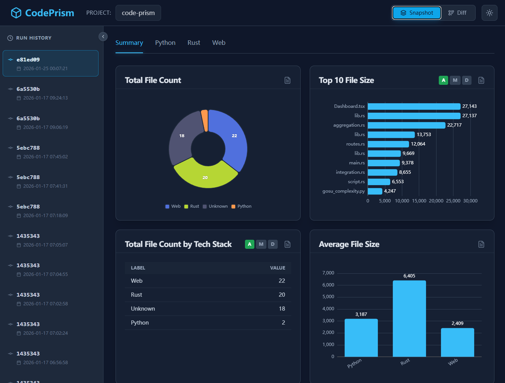
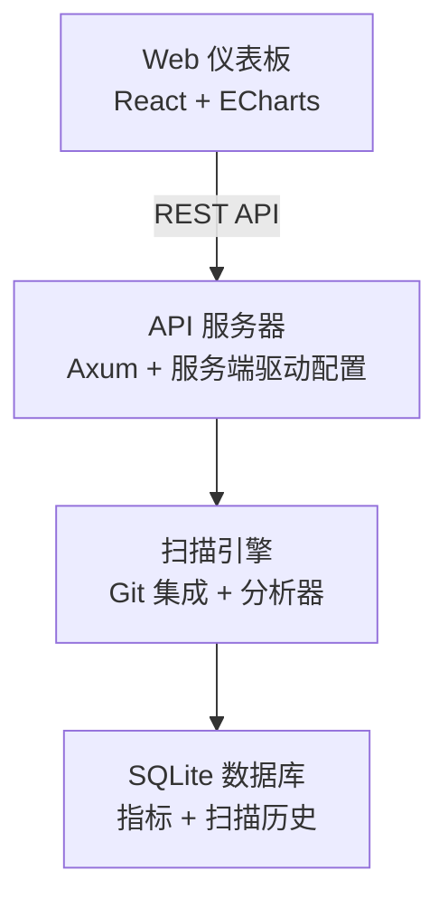

# CodePrism

<p align="center">
  <strong>🔬 高性能 Git 仓库代码分析工具</strong>
</p>

<p align="center">
  <a href="#-快速开始">快速开始</a> •
  <a href="#-安装">安装</a> •
  <a href="#-命令行参考">命令行参考</a> •
  <a href="#-配置">配置</a>
</p>

<p align="center">
  <a href="./README.md">English</a> |
  <a href="./README.zh-CN.md">简体中文</a> |
  <a href="./README.ja.md">日本語</a>
</p>

<p align="center">
  <a href="https://github.com/yougikou/code-prism/releases"></a>
  <a href="https://github.com/yougikou/code-prism/actions"></a>
  <a href="./LICENSE"></a>
</p>

---

CodePrism 是一个使用 Rust 构建的**高性能代码分析工具**。它可以扫描 Git 仓库、提取代码指标，并通过直观的 Web 仪表板提供可操作的洞察。



## ✨ 功能特性

- 🚀 **高性能** - 使用 Rust 构建，速度极快
- 📊 **丰富的分析** - 多种聚合类型和图表可视化
- 🔍 **匹配级别详情** - 从聚合指标下钻到单个正则/Python/WASM 匹配位置，包含行号和代码上下文
- 🔄 **Git 集成** - 支持快照和差异扫描模式，后台任务追踪
- 🎨 **服务端驱动 UI** - 通过 YAML 配置仪表板，灵活网格布局
- 📦 **多项目支持** - 在一个配置文件中管理多个项目，支持可复用模板
- 🔌 **可扩展分析器** - 内置、正则、Python 和 WASM 分析器
- 🌐 **国际化 (i18n)** - 内置多语言 UI（英文、中文、日文）
- 📋 **扫描任务追踪** - 后台扫描执行，实时状态监控

### 架构

- **后端**: 基于 Rust 的 CLI 和 Web 服务器，使用 Axum 框架
- **数据库**: 嵌入式 SQLite，支持自动迁移
- **前端**: React + TypeScript + Vite，使用 rust-embed 嵌入到二进制文件中
- **图表**: Apache ECharts 用于高性能数据可视化
- **Git 操作**: 通过 libgit2 直接访问 Git ODB，无需 checkout

### CLI 命令

- `init` - 初始化数据库并创建默认配置
- `scan <repo>` - 以快照模式扫描仓库
- `scan <repo> --diff <old> <new>` - 以差异模式扫描仓库
- `serve` - 启动带有仪表板的 Web 服务器
- `init-config` - 生成默认配置文件
- `check-config` - 验证配置文件
- `test-analyzers` - 运行 `custom_analyzers/` 中所有 Python 分析器的自测试

### 分析器

- **内置**: 文件计数、字符计数
- **正则**: 通过 YAML 配置的模式匹配
- **Python 脚本**: `custom_analyzers/` 目录中的持久进程分析器
- **WASM**: 通过 wasmtime 运行时执行 WebAssembly 模块

#### Python 脚本分析器

Python 分析器采用**持久循环模式**运行，通过 stdin/stdout 高效通信：

- **输入**: 每个脚本通过 stdin 接收每行一个 JSON 对象：
  ```json
  {"file_path": "src/main.rs", "content": "fn main() { ... }"}
  ```
- **输出**: 脚本通过 stdout 输出 JSON 数组：
  ```json
  [{"value": 5.0, "tags": {"metric": "complexity", "category": "complexity"}}]
  ```
- **匹配详情（可选）**: 分析器可以通过可选的 `matches` 字段返回每个匹配的位置信息：
  ```json
  [{
    "value": 3.0,
    "tags": {"metric": "todo_count", "category": "quality"},
    "matches": [
      {"file_path": "src/main.rs", "line_number": 42, "column_start": 9, "column_end": 21, "matched_text": "TODO: refactor", "context_before": "// FIXME: optimize", "context_after": "fn main() {"}
    ]
  }]
  ```
  匹配详情按扫描存储，可通过 Web 仪表板的子列表弹窗点击文件路径查看。
- **生命周期**: 脚本启动后常驻内存，在多次分析请求间复用，避免解释器启动开销。

每个 Python 分析器可以包含 `test()` 函数，通过以下方式调用：
```bash
python custom_analyzers/my_analyzer.py test
```

一键运行所有分析器的自测试：
```bash
codeprism test-analyzers
```
该命令自动发现 `custom_analyzers/` 中的所有 `.py` 文件并执行它们的测试入口点。

**示例分析器**（`custom_analyzers/`）：
- [`gosu_complexity.py`](custom_analyzers/gosu_complexity.py) — Gosu 语言的圈复杂度计算
- [`java_complexity.py`](custom_analyzers/java_complexity.py) — Java 的圈复杂度计算

### 匹配详情查看

当正则、Python 或 WASM 分析器产生匹配级别的数据时，您可以从聚合图表数值下钻到单个匹配位置：

1. **文件列表弹窗**：点击图表卡片上的 **FileText** 图标，查看所有文件及其指标值
2. **匹配详情弹窗**：点击文件路径，查看该文件内的每个匹配位置，包括：
   - **行号和列** — 每个匹配的精确位置
   - **匹配文本** — 在 UI 中以代码格式高亮显示
   - **上下文行** — 匹配行前后各一行，便于阅读

这提供了从聚合指标到原始分析结果的完整可追溯性。

**API 端点：**

```
GET /api/v1/projects/:project_name/scans/:scan_id/matches?file_path=<路径>[&analyzer_id=<ID>&page=1&page_size=100]
```

### 扫描模式

- **快照模式**: 在特定提交时分析整个仓库
- **差异模式**: 分析两个提交或分支之间的变更（追踪新增/修改/删除类型）

扫描以后台任务方式运行，可通过 API 和 Web 仪表板查看执行状态。

## 📥 安装

### 下载预编译版本（推荐）

从 [GitHub Releases](https://github.com/yougikou/code-prism/releases) 下载适合您平台的最新版本：

| 平台 | 下载文件 |
|------|----------|
| **Linux x86_64** | `codeprism-x86_64-unknown-linux-gnu.tar.gz` |
| **macOS (Apple Silicon)** | `codeprism-aarch64-apple-darwin.tar.gz` |
| **Windows x86_64** | `codeprism-x86_64-pc-windows-msvc.zip` |

```bash
# Linux / macOS
tar xzf codeprism-*.tar.gz
chmod +x codeprism
sudo mv codeprism /usr/local/bin/

# 验证安装
codeprism --version
```

### 从源码构建

```bash
git clone https://github.com/yougikou/code-prism.git
cd code-prism
cargo build --release
# 可执行文件位于 target/release/codeprism
```

### 构建前端 Web

构建过程（`crates/server/build.rs`）将在 `npm` 可用时自动尝试构建前端资源。

如果您想手动构建前端，或者自动构建失败：

```bash
cd web
npm install
npm run build
# 资源文件将生成在 web/dist 目录
```


## 🚀 快速开始

```bash
# 1. 初始化数据库
codeprism init

# 2. 扫描你的仓库
codeprism scan /path/to/your/repo

# 3. 启动 Web 仪表板
codeprism serve
```

在浏览器中打开 **http://localhost:3000**。

## 📖 命令行参考

### 全局选项

```
codeprism [选项] <命令>

选项:
  --config <路径>    配置文件路径（默认：codeprism.yaml）
  --help             显示帮助信息
  --version          显示版本信息
```

### 命令

#### `init` - 初始化数据库

```bash
codeprism init
```

创建 SQLite 数据库（`codeprism.db`）并应用所需的表结构。

#### `scan` - 扫描仓库

```bash
codeprism scan <路径> [选项]

参数:
  <路径>  Git 仓库路径（默认：.）

选项:
  -p, --project <名称>     项目名称（默认：目录名）
  --mode <模式>            扫描模式：snapshot 或 diff（默认：snapshot）
  --commit <哈希>          要扫描的特定提交（快照模式）
  --base <哈希>            比较的基准提交（差异模式，必需）
  --target <哈希>          比较的目标提交（差异模式，默认：HEAD）
```

**示例：**

```bash
# 快照扫描当前目录
codeprism scan .

# 扫描特定提交
codeprism scan . --commit abc123

# 两个提交之间的差异扫描
codeprism scan . --mode diff --base abc123 --target def456

# 使用自定义项目名称扫描
codeprism scan ../my-project --project "MyApp"
```

#### `serve` - 启动 Web 仪表板

```bash
codeprism serve [选项]

选项:
  --port <端口>    服务器端口（默认：3000）
```

**示例：**

```bash
# 在默认端口启动
codeprism serve

# 在自定义端口启动
codeprism serve --port 8080

# 使用自定义配置
codeprism serve --config production.yaml
```

#### `init-config` - 生成配置文件

```bash
codeprism init-config [路径]

参数:
  [路径]  输出文件路径（默认：codeprism.yaml）
```

#### `check-config` - 验证配置文件

```bash
codeprism check-config
```

### 退出码

| 代码 | 描述 |
|------|------|
| `0` | 成功 |
| `1` | 一般错误 |
| `2` | 配置错误 |
| `3` | 数据库错误 |
| `4` | Git 错误 |

## ⚙️ 配置

CodePrism 使用 YAML 配置文件。详情请参见[配置指南](#配置文件格式)。

```bash
# 生成默认配置
codeprism init-config

# 使用自定义配置
codeprism --config my-config.yaml scan .
```

### 配置文件格式

```yaml
database_url: "sqlite:codeprism.db"

global_excludes:
  - "**/.git/**"
  - "**/node_modules/**"

tech_stacks:
  - name: "Rust"
    extensions: ["rs", "toml"]
    analyzers: ["char_count"]

aggregation_views:
  top_files:
    title: "Top 10 最大文件"
    tech_stacks: ["Rust"]
    func:
      type: "top_n"
      metric_key: "char_count"
      limit: 10
    chart_type: "bar_row"
```

**视图显示规则：**
- `tech_stacks` **未定义**或**为空**的视图 → 显示在 **Summary** 标签页
- `tech_stacks` 包含 `"All"` 的视图 → 显示在 **Summary** 标签页
- `tech_stacks` 包含特定技术栈名称的视图 → 显示在对应的技术栈标签页

### 聚合视图 func 配置

聚合视图中的 `func` 对象支持以下字段：

| 字段 | 类型 | 必填 | 说明 |
|------|------|------|------|
| `type` | string | **是** | 聚合类型：`sum`, `avg`, `top_n`, `min`, `max`, `distribution` |
| `metric_key` | string | 否 | 按指标键筛选（如 `"char_count"`） |
| `category` | string | 否 | 按类别筛选（如 `"logging"`） |
| `analyzer_id` | string | 否 | 按分析器 ID 筛选 |
| `limit` | integer | `top_n` 需要 | 返回的结果数量 |
| `buckets` | float[] | `distribution` 需要 | 分布统计的桶边界 |
| `width` | integer | 否 | 网格宽度：`1`（半宽）或 `2`（全宽）。默认为 `1`。 |

**支持的分组键：**

`group_by` 字段支持以下键：`tech_stack`, `category`, `change_type`, `metric_key`, `analyzer_id`。

**示例：**

```yaml
# 仅按 metric_key 筛选
func:
  type: "sum"
  metric_key: "char_count"

# 仅按 category 筛选（不指定 metric_key）
func:
  type: "sum"
  category: "logging"
group_by: ["metric_key"]

# 无筛选条件（统计所有数据）
func:
  type: "sum"
```

### 保留的 metric_key

以下 `metric_key` 为系统保留，自定义分析器应避免使用：

| metric_key | 说明 |
|------------|------|
| `file_count` | 内置分析器，与扫描文件记录对应 |
| `char_count` | 内置分析器，文件字符数 |

### 自定义分析器指南

开发自定义分析器时，需理解 `analyzer_id` 和 `metric_key` 的区别：

| 字段 | 用途 | 作用域 |
|------|------|--------|
| `analyzer_id` | 标识**哪个分析器**产生了指标 | 每个分析器全局唯一 |
| `metric_key` | 标识**什么类型的测量值** | 可跨分析器共享 |
| `category` | 指标分组 | 用于过滤/组织 |

**设计模式：**

1. **多个分析器，相同 metric_key** - 不同语言的分析器可以输出相同的 `metric_key`：
   ```yaml
   # Python 复杂度分析器
   analyzer_id: "python_complexity"
   metric_key: "complexity"
   
   # Java 复杂度分析器
   analyzer_id: "java_complexity"
   metric_key: "complexity"  # 相同的 metric_key，便于统一查询
   ```

2. **一个分析器，多个 metric_keys** - 单个分析器可以输出多个指标：
   ```yaml
   analyzer_id: "code_quality"
   # 输出:
   #   metric_key: "todo_count"
   #   metric_key: "fixme_count"
   ```

### 多项目配置

```yaml
projects:
  - name: "frontend"
    tech_stacks:
      - name: "React"
        extensions: ["tsx", "ts"]
        analyzers: ["char_count"]
    aggregation_views: {}

  - name: "backend"
    tech_stacks:
      - name: "Rust"
        extensions: ["rs"]
        analyzers: ["char_count"]
    aggregation_views: {}
```

项目可以通过 **Web 仪表板 UI** 进行管理 — 直接添加、重命名和删除项目，无需手动编辑 YAML 文件。

### 项目模板

可复用的项目配置定义在 `project_templates` 下：

```yaml
project_templates:
  java_service:
    tech_stacks:
      - name: "Java"
        extensions: ["java", "xml"]
        analyzers: ["char_count"]
    global_excludes:
      - "**/target/**"
```

可以通过 Web 仪表板从模板创建新项目。

## 📊 聚合与图表类型

### 聚合类型

| 类型 | 描述 |
|------|------|
| `top_n` | 按值排序的前 N 项 |
| `sum` | 值的总和 |
| `avg` | 平均值 |
| `min` / `max` | 最小/最大值 |
| `distribution` | 分桶分布 |

### 图表类型

| 类型 | 描述 |
|------|------|
| `bar_row` | 水平条形图 |
| `bar_col` | 垂直条形图 |
| `pie` | 饼图 |
| `table` | 数据表格 |
| `gauge` | 仪表盘 |
| `radar` | 雷达图 |
| `line` | 折线图 |
| `heatmap` | 热力图 |

## 🏗️ 架构



## 📚 文档

- [API 文档](http://localhost:3000/swagger-ui)（需要服务器运行中）
- OpenAPI 规范：`/api-docs/openapi.json`

## 🤝 贡献

欢迎贡献！请查看上述文档了解指南。

## 📄 许可证

MIT License - 详见 [LICENSE](./LICENSE)
